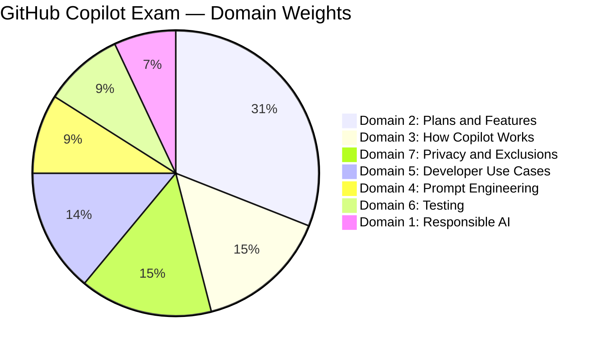
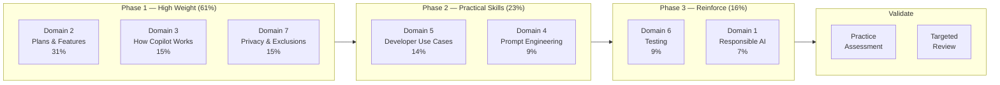
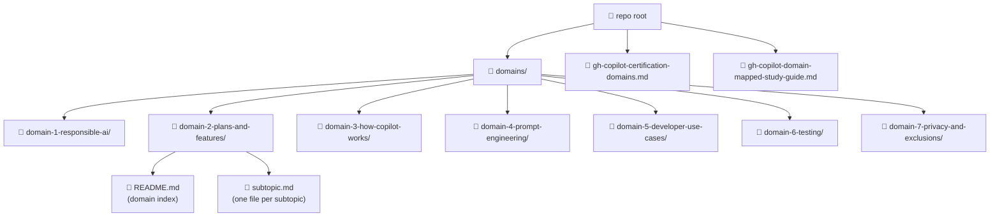
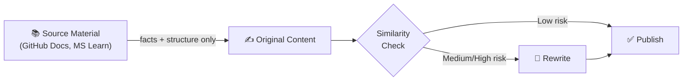

# GitHub Copilot Certification Study Guide

> **Exam:** GitHub Copilot · Exam Code: `COPILOT` · Microsoft Learn ID: `GH-300`

A structured, original study guide for the GitHub Copilot certification exam. Content is organized by exam domain — each domain has its own folder with subtopic pages built from a consistent template.

---

## Exam at a Glance

| Detail | Value |
|--------|-------|
| Level | Intermediate |
| Duration | 100 minutes |
| Cost | USD 99 |
| Validity | 730 days |
| Audience | Developer, DevOps Engineer, App Maker, Technology Manager |
| Certification page | [Microsoft Learn](https://learn.microsoft.com/en-us/credentials/certifications/github-copilot/) |
| Practice assessment | [Take practice test](https://learn.microsoft.com/en-us/credentials/certifications/github-copilot/practice/assessment?assessment-type=practice&assessmentId=218035372&practice-assessment-type=certification) |

---

## Domain Weights

---

## Domains

| # | Domain | Weight | Folder |
|---|--------|--------|--------|
| 1 | Responsible AI | 7% | [domain-1-responsible-ai](./domains/domain-1-responsible-ai/) |
| 2 | GitHub Copilot Plans and Features | 31% | [domain-2-plans-and-features](./domains/domain-2-plans-and-features/) |
| 3 | How GitHub Copilot Works and Handles Data | 15% | [domain-3-how-copilot-works](./domains/domain-3-how-copilot-works/) |
| 4 | Prompt Crafting and Prompt Engineering | 9% | [domain-4-prompt-engineering](./domains/domain-4-prompt-engineering/) |
| 5 | Developer Use Cases for AI | 14% | [domain-5-developer-use-cases](./domains/domain-5-developer-use-cases/) |
| 6 | Testing with GitHub Copilot | 9% | [domain-6-testing](./domains/domain-6-testing/) |
| 7 | Privacy Fundamentals and Context Exclusions | 15% | [domain-7-privacy-and-exclusions](./domains/domain-7-privacy-and-exclusions/) |

---

## Recommended Study Sequence

Study high-weight domains first to maximize exam readiness early.

---

## Repository Structure

Each domain folder contains:
- `README.md` — domain index with links to all subtopics
- one `.md` file per subtopic, following the shared page template

---

## Reference Files

| File | Purpose |
|------|---------|
| [`gh-copilot-certification-domains.md`](./gh-copilot-certification-domains.md) | Authoritative exam domain outline sourced from the certification API |
| [`gh-copilot-domain-mapped-study-guide.md`](./gh-copilot-domain-mapped-study-guide.md) | Maps each domain to Microsoft Learn modules, practice focus, and study sequence |

---

## Content Rules

All content in this repository is **original** — written to explain and teach, not to reproduce source material.

- Source links are cited in every page's **Sources Consulted** section
- No verbatim copying from Microsoft Learn, GitHub Docs, or any proprietary material
- Each page includes an **Originality Declaration** and **Potential Similarity Risk** assessment