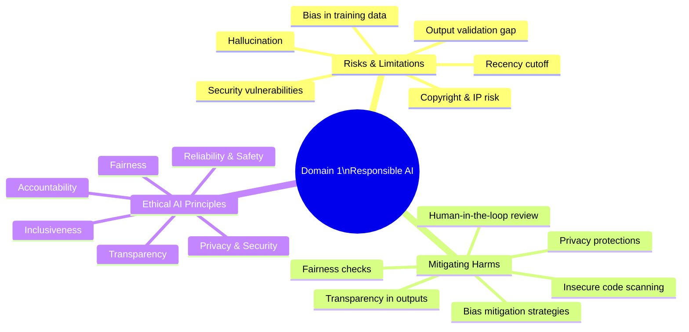

# Domain 1: Responsible AI (7%)

> **Learning Objective:** Understand the risks and limitations of AI-generated code, the strategies used to mitigate potential harms, and the six ethical AI principles that guide responsible use of GitHub Copilot.

[Home](../../README.md) | [Domain Index](./README.md) | [Previous](../../README.md) | [Next](../domain-2-plans-and-features/README.md)

---

## Exam Relevance

- **Domain weight:** 7% — roughly 4–5 questions on the GH-300 exam.
- Even though this domain carries less weight than Domain 2, its questions are conceptual and test applied understanding of AI responsibility, making them straightforward to score if studied well.
- Expect scenario questions that ask you to identify a type of AI risk, choose a mitigation strategy, or map a situation to one of Microsoft's six ethical AI principles.
- Real-world relevance: responsible AI practices are embedded in how GitHub Copilot is designed, what safeguards exist at each plan tier, and what obligations developers carry when using AI assistance.

---

## Mind Map

---

## Comparison Table

| Dimension | AI Risks & Limitations | Mitigating Harms | Ethical AI Principles |
|---|---|---|---|
| **Exam Focus** | Identifying types of AI failure modes | Choosing the right safeguard for a given risk | Mapping a scenario to a named principle |
| **Core Concern** | What can go wrong with AI outputs | How to reduce the impact of those failures | The values that should guide AI system design |
| **Key Mitigation** | Human review of every suggestion | Content filtering, code scanning, exclusions | Embedding principles into product design and policy |
| **Copilot Feature Involved** | None — these are inherent AI traits | Content exclusions, IP indemnity, SAST tools | Applies to all features; IP indemnity → Accountability |
| **Principle Type** | Technical / empirical | Operational / procedural | Normative / ethical |
| **Who Owns It** | AI model provider + developer | Developer + organisation | Microsoft + GitHub + developer community |
| **Example Scenario** | Copilot suggests code that compiles but has a logic flaw | Enabling org-level content exclusions for sensitive files | Ensuring Copilot treats all developers equitably regardless of language or context |

---

## Key Concepts

- **AI-generated output is probabilistic, not deterministic.** Copilot predicts the most likely continuation of your code based on statistical patterns — it does not reason about correctness. This is why all suggestions require human validation.
- **Bias originates in training data.** If the data used to train a model over-represents certain patterns, technologies, or demographics, the model's suggestions will reflect those skews. Developers must be alert to this when reviewing output in sensitive domains.
- **Hallucination is a known, irreducible risk.** Large language models can produce confident-sounding output that is factually wrong, references non-existent APIs, or invents package names. No current model is immune to this.
- **The recency cutoff creates a knowledge gap.** Copilot's training data has a fixed end date. It may suggest deprecated libraries, outdated patterns, or miss recently discovered security vulnerabilities.
- **Human-in-the-loop is non-negotiable.** Responsible AI use means a human developer reviews, tests, and takes ownership of every piece of code accepted from Copilot — automated acceptance without review is an anti-pattern.
- **Microsoft's six ethical AI principles provide a design framework.** They are: Fairness, Reliability & Safety, Privacy & Security, Inclusiveness, Transparency, and Accountability. These are not aspirational slogans — they map to specific product decisions and audit capabilities within Copilot.
- **Automation bias is a social risk.** When developers habitually accept Copilot suggestions without scrutiny, they may inadvertently introduce bugs, security holes, or unfair logic simply because the code "looked right" at a glance.

---

## Domain Cheat Sheet

- **Every AI output must be validated by a human** — this is the foundational responsible AI operating principle.
- **Five potential harms of generative AI:** bias in output, insecure code generation, fairness issues, privacy leakage, lack of transparency.
- **Microsoft's 6 ethical AI principles:** Fairness · Reliability & Safety · Privacy & Security · Inclusiveness · Transparency · Accountability.
- **Hallucination** = AI generating plausible but incorrect content with apparent confidence.
- **Automation bias** = over-trusting AI suggestions without applying critical developer judgment.
- **Recency cutoff** = the training data end date beyond which Copilot has no awareness of new vulnerabilities, APIs, or changes.
- **Copyright / IP risk** = Copilot may reproduce training-data patterns that resemble copyrighted code; mitigated by IP indemnity on Business and Enterprise plans.
- **IP indemnity is a Business/Enterprise-only feature** — it provides legal protection if Copilot output is found to infringe third-party IP.
- **Content exclusions** reduce the risk of Copilot processing or leaking sensitive repository content; available on Business and Enterprise plans only.
- **Insecure code risk** — Copilot may suggest vulnerable patterns (e.g. SQL injection, hard-coded secrets); always pair AI-assisted development with static analysis / SAST tooling.
- **Fairness principle** focuses on avoiding discriminatory outcomes; **Accountability principle** ensures clear ownership of AI decisions.
- **Human-in-the-loop** is the core responsible AI operating practice — AI assists, humans decide.

---

## Subtopics

| Page | Description |
|---|---|
| [AI Risks and Limitations](./risks-and-limitations.md) | Covers hallucination, bias, recency cutoff, copyright risk, and security vulnerabilities in AI-generated code. |
| [Mitigating Harms of Generative AI](./mitigating-harms.md) | Covers strategies and Copilot features used to reduce bias, insecure output, privacy leakage, and lack of transparency. |
| [Ethical AI Principles](./ethical-ai.md) | Covers Microsoft's six ethical AI principles and how each maps to GitHub Copilot design and developer responsibility. |

---

## Originality Declaration

All explanations, examples, cheat sheet bullets, table content, and diagram labels on this page are original. They were composed by synthesising publicly available documentation and training guidance — no source text was copied verbatim. The six Microsoft ethical AI principles are factual names drawn from official documentation and are reproduced as proper nouns only.

## Sources Consulted

- https://docs.github.com/en/copilot/responsible-use-of-github-copilot-features
- https://www.microsoft.com/en-us/ai/responsible-ai
- https://learn.microsoft.com/en-us/training/modules/responsible-ai-principles/

## Potential Similarity Risk

**Low.** The six principle names (Fairness, Reliability & Safety, Privacy & Security, Inclusiveness, Transparency, Accountability) are proper nouns and cannot be reworded without losing their identity. All surrounding explanations, comparisons, and examples are independently composed. No list items, sentences, or paragraphs were reproduced from the source pages.

## References

- Facts referenced; all explanations and examples are original.
- GitHub Docs — Responsible use of GitHub Copilot features: https://docs.github.com/en/copilot/responsible-use-of-github-copilot-features
- Microsoft Responsible AI principles overview: https://www.microsoft.com/en-us/ai/responsible-ai
- Microsoft Learn — Responsible AI principles module: https://learn.microsoft.com/en-us/training/modules/responsible-ai-principles/

---

[Home](../../README.md) | [Domain Index](./README.md) | [Previous](../../README.md) | [Next](../domain-2-plans-and-features/README.md)
