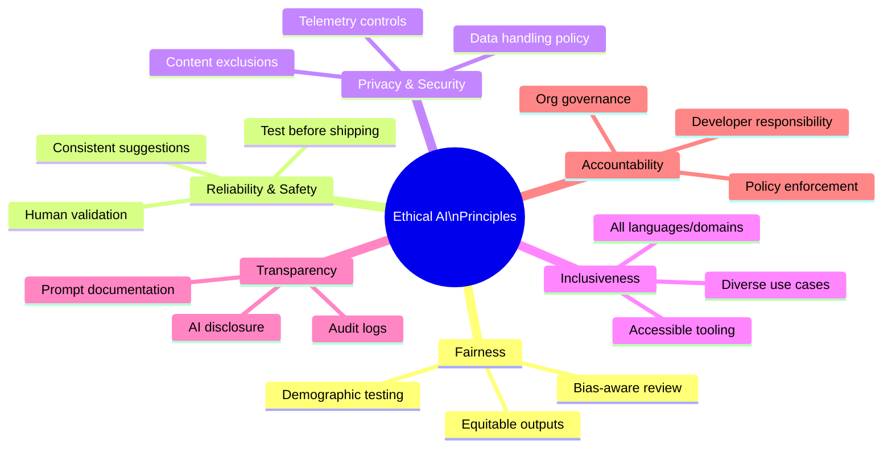

# Ethical AI Principles

> **Learning Objective:** Understand Microsoft's six Responsible AI principles, how each one applies to GitHub Copilot, and why human oversight is the central guard against automation bias.

[Home](../../README.md) | [Domain Index](./README.md) | [Previous](./mitigating-harms.md) | [Next](../domain-2-plans-and-features/README.md)

---

## Exam Relevance

- **Domain weight:** 7%
- **Why it matters:** The GitHub Copilot certification tests whether candidates understand the ethical guardrails that govern responsible AI use — not just what Copilot can do, but what responsible practitioners are expected to do with it. Questions frequently ask you to identify which principle applies to a given scenario, recognize the risk of automation bias, and match Copilot features (audit logs, telemetry controls, content exclusions) to the principles they support. Understanding these principles also underpins every other domain, since responsible use is the lens through which Copilot's features are evaluated.

---

## Key Concepts

- **Microsoft's Responsible AI framework defines six guiding principles** — Fairness, Reliability & Safety, Privacy & Security, Inclusiveness, Transparency, and Accountability — that apply to all AI systems Microsoft builds or supports, including GitHub Copilot. Exam questions will test your ability to map features and behaviours to the correct principle.
- **Fairness means outputs must not embed or amplify bias.** When Copilot suggests code that makes assumptions about user demographics, data formats, or access patterns, developers have a responsibility to critically review those assumptions before accepting the suggestion. Fairness is an active practice, not a passive guarantee.
- **Reliability & Safety treats every Copilot suggestion as a draft, not a deliverable.** The model can produce plausible-looking code that is functionally incorrect, insecure, or untested. Skipping human validation before shipping AI-assisted code violates the reliability principle and creates safety risk.
- **Privacy & Security are supported by specific Copilot controls:** telemetry can be turned off so usage data is not sent to GitHub, content exclusion rules can prevent specific files or repositories from being used as context, and GitHub's data-handling policy limits how prompts and completions are retained. These are not just product features — they are the organisation's privacy & security mechanism.
- **Inclusiveness requires that Copilot deliver value across the full range of developers,** not just those working in the most popular languages or on well-resourced teams. Support for multiple IDEs, programming languages, and developer skill levels is the practical expression of the inclusiveness principle.
- **Transparency and Accountability are complementary obligations.** Transparency means that stakeholders — teammates, auditors, end users — should be able to see when and how AI contributed to an outcome. Accountability closes the loop: it places responsibility for AI-assisted code squarely with the human developer who reviewed and shipped it, not with the model.
- **Automation bias is the most common day-to-day ethical failure mode.** Because Copilot's output looks polished and confident, developers are prone to accepting suggestions without adequate scrutiny. Countering automation bias requires deliberate habits: read every suggestion critically, run tests, and never treat a completion as equivalent to a manually authored and reviewed solution.

---

## Visual Model

**Diagram notes:**

- The six branches represent Microsoft's Responsible AI principles as applied to GitHub Copilot. Each branch is a first-class exam topic.
- **Fairness, Reliability & Safety, and Privacy & Security** are the most frequently tested in scenario-based questions — they map directly to observable Copilot behaviours and developer actions.
- **Transparency** and **Accountability** are closely linked: audit logs (a Transparency mechanism) produce the evidence that supports Accountability when things go wrong.
- **Automation bias**, while not one of the six named principles, is the most common exam distractor — it describes the failure state that occurs when all six principles are under-applied.

---

## Key Terms

- **Ethical AI**: A framework of principles guiding the design, development, and use of AI to ensure it is safe, fair, and accountable.
- **Fairness (AI)**: The principle that AI systems should not discriminate or produce inequitable outcomes across demographic groups.
- **Reliability**: The expectation that an AI system produces consistent, predictable results and fails gracefully when conditions are unusual.
- **Transparency**: Clear disclosure of when and how AI systems are involved in producing outputs or decisions.
- **Accountability**: The obligation of individuals and organisations to own and answer for the outcomes produced by AI systems they deploy.
- **Automation bias**: The cognitive tendency to uncritically trust and follow AI-generated outputs, reducing the quality of human oversight.
- **Human oversight**: The requirement for a human to review, validate, and take responsibility for AI-generated content or decisions.
- **Inclusiveness**: The principle that AI tools and outputs should serve all users equitably, regardless of language, background, or ability.

---

## Cheat Sheet

| Principle | What It Means | Copilot Connection |
|---|---|---|
| Fairness | Equitable treatment for all users | Review AI code for demographic assumptions |
| Reliability & Safety | Consistent, safe performance | Validate all suggestions; never skip testing |
| Privacy & Security | Protect personal data | Telemetry controls, content exclusions |
| Inclusiveness | Works for everyone | Supports multiple languages and IDEs |
| Transparency | Explain how AI decisions are made | Audit logs, AI contribution disclosure |
| Accountability | Humans own AI outcomes | Developers responsible for shipped code |
| Automation bias | Danger to ethical use | Over-trusting AI without review |
| Human oversight | Core requirement | Review every suggestion before accepting |

---

## Quick Recap

- Microsoft's Responsible AI framework has **six principles**: Fairness, Reliability & Safety, Privacy & Security, Inclusiveness, Transparency, and Accountability — memorise all six and be able to match them to Copilot features or developer actions.
- **Copilot suggestions are drafts.** The Reliability & Safety principle requires testing and human validation before any AI-assisted code ships to production.
- **Telemetry controls and content exclusions** are the primary Privacy & Security mechanisms available at the individual and organisational level in Copilot.
- **Audit logs** (Business/Enterprise plans) are the main Transparency tool — they give organisations visibility into Copilot adoption and usage patterns.
- **Automation bias** is the most common everyday risk: the habit of accepting AI output without review. The countermeasure is consistent, deliberate human oversight on every suggestion.

---

## Practice Questions

1. **Scenario:** A developer copies an AI-generated authentication function directly into a PR without reviewing it. Which ethical AI principle has been most directly neglected?
   - **Answer:** Accountability (and human oversight)
   - **Rationale:** The developer is responsible for all code they ship regardless of its source. Skipping review violates the accountability principle and enables automation bias. The model cannot be held accountable — the human who accepted and merged the code can.

2. **Question:** Which Copilot feature most directly supports the Transparency principle at the organisational level?
   - **Answer:** Audit logs (available on GitHub Copilot Business and Enterprise plans)
   - **Rationale:** Audit logs give organisations visibility into how Copilot is being used across teams and projects, supporting disclosure and governance requirements — both of which are core expressions of the transparency principle.

3. **Question:** What is automation bias, and what is the recommended countermeasure when using GitHub Copilot?
   - **Answer:** Automation bias is the tendency to accept AI output uncritically because it appears authoritative or polished. The countermeasure is to treat every Copilot suggestion as a starting point that requires independent verification, not a finished solution.
   - **Rationale:** Ethical AI use requires active human judgement. Automation bias is the most common failure mode in day-to-day AI tool use because the output quality of modern models makes it easy to skip the review step.

4. **Question:** Which ethical AI principle is most directly supported by Copilot's telemetry controls and content exclusion settings?
   - **Answer:** Privacy & Security
   - **Rationale:** Telemetry controls let users and organisations decide what usage data is shared with GitHub. Content exclusions prevent sensitive files from being used as prompt context. Both are deliberate privacy and security mechanisms — not just feature settings.

5. **Scenario:** A development team is unsure whether they need to disclose in their documentation that portions of the codebase were assisted by AI. Which ethical AI principle should guide their decision?
   - **Answer:** Transparency
   - **Rationale:** The transparency principle requires that stakeholders understand when and how AI systems have contributed to outputs or decisions. Disclosing AI-assisted authorship in documentation or commit history is a direct application of this principle at the team level.

---

## Originality Declaration

All explanations, examples, practice questions, cheat sheet content, and summaries on this page are original instructional content written for this study guide. No text has been copied verbatim from any source. The six principle names (Fairness, Reliability & Safety, Privacy & Security, Inclusiveness, Transparency, Accountability) are Microsoft's published framework labels and are used as factual reference terms only. All descriptions, Copilot-specific applications, and scenario narratives are newly composed.

---

## Sources Consulted

- <https://www.microsoft.com/en-us/ai/responsible-ai>
- <https://learn.microsoft.com/en-us/training/modules/responsible-ai-principles/>
- <https://docs.github.com/en/copilot/responsible-use-of-github-copilot-features>

---

## Potential Similarity Risk

- **Risk level:** Low
- **Notes:** The six principle names (Fairness, Reliability, etc.) are Microsoft's published framework terms and are used as reference labels, not copied prose. All explanations, scenario narratives, and Copilot-specific applications are original. No line-by-line paraphrase of source material was used. No exam dump content was referenced.

---

## References

- Facts about the six Responsible AI principles are grounded in Microsoft's public Responsible AI documentation. All explanations are original.
- <https://www.microsoft.com/en-us/ai/responsible-ai>
- <https://learn.microsoft.com/en-us/training/modules/responsible-ai-principles/>
- <https://docs.github.com/en/copilot/responsible-use-of-github-copilot-features>

---

[Home](../../README.md) | [Domain Index](./README.md) | [Previous](./mitigating-harms.md) | [Next](../domain-2-plans-and-features/README.md)
