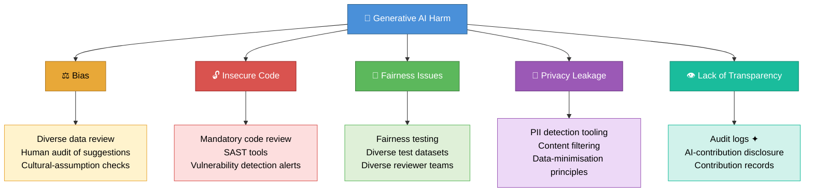

# Mitigating Harms of Generative AI

> **Learning Objective:** Identify the five categories of potential harm that generative AI can introduce, explain a concrete mitigation strategy for each, and describe which GitHub Copilot features support harm reduction at the organisational level.

[Home](../../README.md) | [Domain Index](./README.md) | [Previous](./risks-and-limitations.md) | [Next](./ethical-ai.md)

---

## Exam Relevance

- **Domain weight:** 7% (Domain 1 — Responsible AI)
- Exam questions in this area test whether candidates can name the five harm categories, match each category to at least one mitigation, and identify the specific Copilot features (audit logs, content filters, duplication detection, content exclusions, IP indemnity) that reduce organisational risk.
- Understanding harm mitigation is also foundational for questions on responsible deployment in Domain 3 (setting up Copilot for an organisation) and Domain 4 (responsible usage by individual developers).
- Real-world relevance is high: teams that ship AI-generated code without a mitigation strategy regularly encounter security vulnerabilities, IP disputes, and compliance failures.

---

## Key Concepts

- **Generative AI introduces new risk vectors that differ from traditional software bugs.** Unlike a syntax error a linter will catch, harms such as algorithmic bias or privacy leakage may be invisible at code-review time and only surface in production.
- **The five categories of potential harm are: Bias, Insecure Code, Fairness Issues, Privacy Leakage, and Lack of Transparency.** Each has a distinct root cause — from unrepresentative training data (bias, fairness) to reproduced vulnerable patterns (insecure code) to missing governance (transparency).
- **Mitigation is a shared responsibility.** GitHub Copilot's built-in features (content filters, duplication detection, audit logs) reduce risk at the platform level, but developers and organisations must layer in human review, security tooling, and disclosure practices on top.
- **Not all Copilot safety features are available on every plan.** IP indemnity, audit logs, and content exclusions require Business or Enterprise plans — a fact that frequently appears in exam scenarios.
- **Static Application Security Testing (SAST) is a key tool in the insecure-code mitigation stack.** Automated scanners catch common vulnerability patterns (injection, hard-coded secrets, weak crypto) that a rushed reviewer might miss in AI-generated code.
- **Privacy mitigation is not only about filtering outputs.** Applying data-minimisation principles — not requesting or generating more data than is needed — reduces exposure before a suggestion is ever produced.
- **Transparency requires active process decisions, not just tooling.** Audit logs provide the record, but teams must also adopt explicit conventions for disclosing AI contributions in commit messages, pull-request descriptions, and code reviews.

---

## Visual Model

**Diagram notes:**

- The five coloured nodes represent the five harm categories that generative AI can introduce. Each fans out from the central risk node.
- The lighter rectangular nodes beneath each harm show the primary mitigation strategies for that category.
- ✦ marks features that are exclusive to Copilot **Business** or **Enterprise** plans — the audit log being the primary exam-tested example.
- This structure mirrors the exam's expectation that candidates can move from "harm category → mitigation → Copilot feature" in both directions.

---

## Key Terms

- **Algorithmic bias**: Systematic error in AI output caused by imbalanced or prejudiced training data, leading to suggestions that disadvantage or misrepresent certain groups or contexts.
- **IP indemnity**: A contractual protection offered by GitHub on Business and Enterprise plans that covers an organisation's legal liability if a Copilot suggestion matches copyrighted publicly available code.
- **Content filter**: An automated screening layer built into Copilot's proxy service that evaluates generated output and blocks suggestions that violate safety or policy rules before they reach the developer's editor.
- **Duplication detection**: An optional Copilot setting that suppresses code suggestions closely matching publicly available licensed code, reducing copyright and intellectual-property risk.
- **Audit log**: A tamper-evident, organisation-level record of Copilot usage events (who used Copilot, when, and in what context); available on Business and Enterprise plans to support governance and transparency.
- **PII (Personally Identifiable Information)**: Any data that can be used to identify a specific individual; AI-generated code must not inadvertently expose, log, or mishandle PII in violation of privacy regulations.
- **Transparency**: The deliberate practice of disclosing when and how AI tools contributed to code, decisions, or artefacts, so that reviewers, auditors, and stakeholders can assess accountability.
- **SAST (Static Application Security Testing)**: Automated analysis of source code — without executing it — to identify security vulnerabilities such as injection flaws, hard-coded credentials, or insecure API usage before the code ships.

---

## Cheat Sheet

| Harm Category | What Goes Wrong | Concrete Risk Example | Key Mitigation | Copilot Feature That Helps |
|---|---|---|---|---|
| **Bias** | Training data reflects demographic or cultural imbalance | Name-validation logic that only handles Western naming formats | Diverse reviewer audit; cultural-assumption checks | No direct feature — relies on human process |
| **Insecure Code** | AI reproduces vulnerable patterns from its training corpus | SQL injection via unsanitised string concatenation; hard-coded credentials | Mandatory security-focused code review; SAST tools | Vulnerability detection alerts |
| **Fairness Issues** | Outputs treat users unequally based on demographic attributes | Recommendation algorithm that under-serves minority groups due to unrepresentative training data | Fairness testing with diverse datasets; diverse review teams | Content filters (screens outputs) |
| **Privacy Leakage** | AI suggestions expose or mishandle personal data | Logging function that inadvertently records PII fields | Data-minimisation principles; PII detection tooling | Content exclusions (Business/Enterprise) |
| **Lack of Transparency** | Stakeholders unaware of AI involvement in code or decisions | AI-generated code merged without disclosure; unclear attribution | Explicit AI-contribution disclosure; audit records | Audit logs (Business/Enterprise) |
| **IP Indemnity** | Copilot suggestion matches copyrighted public code | Legal claim against organisation for shipping matched code | Use duplication-detection filter; enable IP indemnity | IP indemnity (Business/Enterprise) |

> **Plan reminder:** IP indemnity, audit logs, and content exclusions are **Business/Enterprise only**. The duplication-detection filter and content filters are available across all paid plans.

---

## Quick Recap

- Generative AI carries **five primary harm categories**: bias, insecure code, fairness issues, privacy leakage, and lack of transparency — each requiring a different mitigation approach.
- **Platform mitigations** built into GitHub Copilot include content filters, duplication detection, vulnerability detection alerts, audit logs, content exclusions, and IP indemnity.
- **Human-process mitigations** — code review, SAST tooling, fairness testing, and AI-contribution disclosure — are not replaced by Copilot features; they are required on top of them.
- **Audit logs and IP indemnity are plan-gated**: organisations on Individual plans do not have access to these governance features.
- The exam tests the ability to **match a described scenario to its harm category** and then **select the most appropriate mitigation or Copilot feature** that addresses it.

---

## Practice Questions

1. **Scenario:** A developer on a solo project uses GitHub Copilot to auto-complete a database query function. The suggestion builds a SQL string by directly concatenating a user-supplied search term into the query. The developer accepts the suggestion and merges it without further review. Which harm category does this scenario represent, and what is the most direct mitigation?

   - **Answer:** Insecure code. The direct mitigation is mandatory security-focused code review, optionally backed by a SAST tool that would flag the unsanitised concatenation pattern.
   - **Rationale:** The AI has reproduced a common but vulnerable pattern — string-concatenation SQL — from its training data. This is the defining characteristic of the "insecure code" harm category. Code review is the most direct control; SAST provides automation to catch what reviewers miss.

2. **Scenario:** An engineering manager wants to track which developers in her organisation are using GitHub Copilot and when. She needs this data for a compliance audit. Which Copilot feature satisfies this requirement, and on which plans is it available?

   - **Answer:** Audit logs. Available on Copilot **Business** and **Enterprise** plans only.
   - **Rationale:** Audit logs provide an organisation-level record of Copilot usage events. This is a direct transparency and governance feature. Individual plan subscribers do not have access to org-level audit logs.

3. **Scenario:** A legal team is concerned that a Copilot suggestion in their codebase may reproduce a segment from a well-known open-source library under a restrictive licence. The company holds a Copilot Business subscription. Which two mechanisms reduce the risk of this scenario?

   - **Answer:** (1) **Duplication detection** (suppresses suggestions that closely match publicly available code) and (2) **IP indemnity** (provides contractual protection against copyright claims if a matching suggestion was still delivered).
   - **Rationale:** Duplication detection is the preventive control — it blocks the risky suggestion before it reaches the developer. IP indemnity is the corrective backstop — it covers liability if a match slips through. Both are available on Business/Enterprise.

4. **Scenario:** A data-science team uses Copilot to generate a customer recommendation engine. During QA, a reviewer notices that the algorithm's output consistently under-recommends products to users whose profile locale is set to certain regions. The training data used for the model was sourced entirely from one geographic market. Which harm category does this represent, and which two mitigations should the team apply?

   - **Answer:** **Fairness issues**. Mitigations: (1) test the AI-generated recommendation logic against a geographically and demographically diverse test dataset to surface disparate outcomes, and (2) involve a diverse reviewer team that includes stakeholders familiar with under-represented regions.
   - **Rationale:** Fairness issues arise when training data is unrepresentative, causing the model's outputs to benefit some groups disproportionately. Unlike bias (which affects the AI's suggestions), fairness issues are about unequal treatment of end users by AI-generated logic. Testing with diverse data is the key exam-expected mitigation.

5. **Scenario:** A financial-services firm adopts Copilot at scale. Their compliance officer asks: "How do we prove to auditors that Copilot was used responsibly and that sensitive internal repositories were not used as suggestion context?" Which two Copilot features address this concern, and what plan is required?

   - **Answer:** **Audit logs** (prove responsible usage with usage event records) and **content exclusions** (prevent specific files or repositories from being used as Copilot context). Both require **Business or Enterprise** plans.
   - **Rationale:** Content exclusions directly protect sensitive internal code from influencing suggestions — addressing context-governance concerns. Audit logs provide the evidentiary trail required for compliance reporting. Both are governance-tier features gated behind paid organisational plans.

---

## Originality Declaration

- All explanations, examples, scenarios, and practice questions on this page were written as original instructional content for exam-preparation purposes.
- No protected, proprietary, or verbatim source text has been copied. Terminology and feature names are used factually to describe publicly documented GitHub Copilot capabilities.
- The five harm categories and associated Copilot features are drawn from publicly available Microsoft/GitHub responsible-AI documentation and are referenced rather than reproduced.

---

## Sources Consulted

- <https://docs.github.com/en/copilot/responsible-use-of-github-copilot-features>
- <https://www.microsoft.com/en-us/ai/responsible-ai>
- <https://docs.github.com/en/copilot/overview-of-github-copilot/about-github-copilot-individual>
- <https://docs.github.com/en/enterprise-cloud@latest/admin/monitoring-activity-in-your-enterprise/reviewing-audit-logs-for-your-enterprise/audit-log-events-for-your-enterprise>
- <https://docs.github.com/en/copilot/managing-copilot/managing-github-copilot-in-your-organization/managing-github-copilot-features-in-your-organization/about-content-exclusions-for-github-copilot>

---

## Potential Similarity Risk

- **Risk level:** Low
- **Notes:** All prose is newly composed. Feature names (audit logs, IP indemnity, content exclusions, duplication detection, SAST) are used as factual proper nouns to describe publicly documented functionality — this is attribution, not reproduction. No sentence on this page has been paraphrased line-by-line from any source document. The five harm categories are a widely cited taxonomy in responsible-AI literature; their naming reflects established convention, not copied phrasing.

---

## References

- Facts referenced; all explanations and examples are original.
- GitHub Docs — Responsible use of Copilot features: <https://docs.github.com/en/copilot/responsible-use-of-github-copilot-features>
- Microsoft Responsible AI principles: <https://www.microsoft.com/en-us/ai/responsible-ai>
- GitHub Copilot plans and features overview: <https://docs.github.com/en/copilot/overview-of-github-copilot/about-github-copilot-individual>
- GitHub content exclusions documentation: <https://docs.github.com/en/copilot/managing-copilot/managing-github-copilot-in-your-organization/managing-github-copilot-features-in-your-organization/about-content-exclusions-for-github-copilot>

---

[Home](../../README.md) | [Domain Index](./README.md) | [Previous](./risks-and-limitations.md) | [Next](./ethical-ai.md)
