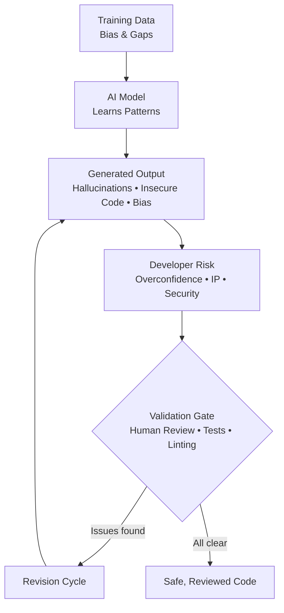

# AI Risks and Limitations

> **Learning Objective:** Identify the key risks and inherent limitations of AI-assisted code generation tools, and explain why human validation is essential before accepting any AI suggestion.

[Home](../../README.md) | [Domain Index](./README.md) | [Previous](./README.md) | [Next](./mitigating-harms.md)

---

## Exam Relevance

- **Domain weight:** 7% (Domain 1 — Responsible AI)
- This subtopic tests your ability to recognise _what can go wrong_ when developers rely on generative AI tools such as GitHub Copilot.
- Exam questions frequently ask about specific risk categories (hallucination, automation bias, IP risk) and the role of validation gates.
- Understanding these limitations is foundational to every other responsible-AI topic in the certification.

---

## Key Concepts

- **AI suggestions are probabilistic drafts, not verified solutions.** A language model generates its next token based on statistical patterns learned during training — it has no semantic understanding of correctness, safety, or copyright status.
- **Hallucination is a structural property of large language models.** Because models predict probable continuations, they can produce syntactically convincing code that calls non-existent APIs, inverts logic, or silently drops error handling — often without any indication that something is wrong.
- **Automation bias amplifies hallucination risk.** When developers trust AI output uncritically — skimming rather than reviewing — subtle errors survive into production. The risk scales with confidence: the more polished a suggestion looks, the more likely it is to be accepted without scrutiny.
- **Training data shapes every limitation.** The model can only suggest patterns it has seen. Gaps in the training corpus (rare languages, niche frameworks, recent security patches) produce weaker suggestions. Over-representation of one style skews outputs toward that style even when it is inappropriate.
- **The context window is a hard boundary on relevance.** Copilot processes a fixed-size window of surrounding code. A suggestion may be locally coherent — correct syntax, sensible variable names — yet semantically wrong for the wider codebase because the model cannot "see" distant files, global state, or architectural decisions outside that window.
- **Security vulnerabilities travel through training data.** If insecure patterns (e.g., string-concatenated SQL queries, unchecked user input passed to `eval`) are prevalent in training data, the model will reproduce them. AI tools do not apply security reasoning; they reproduce what they have learned.
- **Intellectual property risk is real but manageable.** Suggestions may closely resemble copyrighted or licensed code fragments from the training corpus. GitHub Copilot's Business and Enterprise plans provide IP indemnity as a mitigation, but the underlying risk exists on all plans.

---

## Visual Model

**Diagram notes:**

- **Training Data → AI Model:** Everything the model can suggest is bounded by what it was trained on. Biased or incomplete training data propagates directly into output quality.
- **Generated Output → Developer Risk:** The raw suggestion carries latent risks — incorrect logic, security flaws, or IP-adjacent patterns — that only become _actual_ risks when a developer accepts them without review.
- **Validation Gate:** This is the critical control point. Human review, automated tests, and static analysis together decide whether a suggestion is safe to ship or must loop back for revision.
- **Revision Cycle:** When issues are found, the suggestion returns to the generation phase, either through manual correction or re-prompting with better context.

---

## Key Terms

- **Hallucination**: AI generating plausible-sounding but factually incorrect content — such as inventing function signatures or fabricating package names — often presented with apparent confidence.
- **Automation bias**: The tendency to over-trust or uncritically accept AI-generated outputs without applying independent human judgment, increasing the chance that errors reach production.
- **Training cutoff**: The date beyond which the model has no knowledge of new events, APIs, security patches, or language features; suggestions about post-cutoff topics will be outdated or wrong.
- **Context window**: The maximum amount of text a model can process in a single prompt; limits how much surrounding code GitHub Copilot can consider when generating a suggestion.
- **Source data bias**: Skewed representation in training data that causes the model to favour certain languages, frameworks, or coding patterns — even when those patterns are suboptimal or irrelevant to the current task.
- **IP (Intellectual Property) risk**: The possibility that AI-generated code resembles copyrighted or licensed code from the training corpus, creating legal exposure for the developer or organisation.
- **Human-in-the-loop**: A design principle requiring a human to review and approve AI outputs before they are committed or deployed, preserving accountability and catching errors that automated checks miss.
- **Validation gate**: A structured checkpoint — comprising code review, testing, and static analysis — that prevents unsafe or incorrect AI suggestions from reaching production.

---

## Cheat Sheet

| Risk / Limitation | Key Exam Fact |
|---|---|
| **Hallucination** | AI can generate incorrect outputs with high apparent confidence; verification is always required |
| **Automation bias** | Accepting suggestions without critical review is a developer-side risk that leads to low-quality or unsafe code |
| **Training cutoff** | The model has no knowledge of APIs, patches, or features released after its training cutoff date |
| **Source data bias** | Over-represented patterns in training data skew suggestions; minority languages/frameworks receive weaker support |
| **IP risk** | Suggestions may resemble copyrighted code from training data; IP indemnity is available on Business and Enterprise plans only |
| **Security vulnerabilities** | AI mirrors insecure patterns present in training data (e.g., SQL injection, XSS); it does not apply security reasoning |
| **Context window** | Limited scope means the model may miss broader codebase semantics, producing locally correct but globally wrong suggestions |
| **Validation** | Human review + automated tests + linting form the responsible-operation chain; no single check is sufficient alone |

---

## Quick Recap

- AI suggestions are statistical pattern completions, not verified solutions — treat every suggestion as a draft that requires review.
- Hallucination and automation bias are the two most commonly tested risks: hallucination originates in the model; automation bias originates in the developer's behaviour.
- Training data cutoff and source data bias are limitations baked into how the model was built; they cannot be patched away by the developer.
- The context window boundary means Copilot can produce syntactically sound but semantically wrong code when the relevant logic lives outside its visible window.
- The validation gate — human review, tests, linting — is the primary defence against all categories of AI risk reaching production.

---

## Practice Questions

1. **A developer uses GitHub Copilot to generate a call to a third-party authentication library. The code compiles cleanly, but at runtime the application throws a `MethodNotFoundError` because the function Copilot suggested does not exist in the installed version of the library. Which AI limitation best explains this outcome?**

   - **Answer:** Hallucination — the model generated a plausible but non-existent API call.
   - **Rationale:** Hallucination occurs when a model produces output that sounds correct but is factually wrong. In this case Copilot fabricated a function signature that does not exist, a classic hallucination pattern especially common with library APIs introduced or changed after the model's training cutoff.

2. **A team notices that GitHub Copilot consistently suggests code patterns suited to one popular web framework, even when the project uses a different one. What is the most likely root cause?**

   - **Answer:** Source data bias — the training corpus over-represents the popular framework, causing the model to default to its patterns.
   - **Rationale:** When one language, framework, or coding style dominates the training data, the model learns to favour it. Suggestions in under-represented contexts will be weaker or inappropriately styled, because the model is reproducing statistical patterns rather than reasoning about the task.

3. **An engineering manager wants to ensure that AI-generated code suggestions do not introduce security vulnerabilities into their production codebase. Which practice most directly addresses this goal?**

   - **Answer:** Establishing a validation gate consisting of mandatory code review, automated security scanning, and test coverage requirements before merging any AI-assisted code.
   - **Rationale:** AI tools can mirror insecure patterns from training data; they do not apply security reasoning. A validation gate — combining human review with automated analysis — is the only reliable control between AI suggestion and production deployment.

4. **During a sprint retrospective, a senior engineer observes that junior developers on the team are merging Copilot suggestions after only a brief glance, reasoning that "the AI checked it." What developer risk does this behaviour represent, and what is the recommended countermeasure?**

   - **Answer:** Automation bias — uncritical acceptance of AI output. The countermeasure is enforcing a human-in-the-loop review process and educating developers that AI suggestions are drafts, not finished solutions.
   - **Rationale:** Automation bias is the documented tendency to over-trust automated systems. In the context of AI coding tools, this means developers skip the critical scrutiny that would catch hallucinations, logic errors, and security flaws. Structured review processes and team norms that treat AI output as a starting point are the primary mitigations.

---

## Originality Declaration

- All explanations, examples, practice questions, and rationale text on this page were written as original instructional content.
- No source text was copied verbatim from any documentation, course, or third-party material.
- Factual claims (risk categories, plan-level IP indemnity, context window behaviour) are grounded in publicly available GitHub and Microsoft documentation; the language used to explain them is independently written.

---

## Sources Consulted

- <https://docs.github.com/en/copilot/responsible-use-of-github-copilot-features>
- <https://learn.microsoft.com/en-us/azure/ai-services/openai/overview>
- <https://docs.github.com/en/copilot/overview-of-github-copilot/about-github-copilot-individual>

---

## Potential Similarity Risk

- **Risk level:** Low
- **Notes:** The risk categories (hallucination, automation bias, training cutoff, etc.) are well-established industry terms used across many sources. Their definitions here follow standard usage but are phrased independently. The cheat sheet structure and practice scenarios are original compositions. No section was drafted by paraphrasing a specific source line-by-line.

---

## References

- Facts referenced; explanations are original.
- <https://docs.github.com/en/copilot/responsible-use-of-github-copilot-features> — responsible use guidance and IP indemnity details
- <https://learn.microsoft.com/en-us/azure/ai-services/openai/overview> — Azure OpenAI model behaviour and limitations
- <https://docs.github.com/en/copilot/overview-of-github-copilot/about-github-copilot-individual> — plan feature comparison including IP indemnity scope

---

[Home](../../README.md) | [Domain Index](./README.md) | [Previous](./README.md) | [Next](./mitigating-harms.md)
