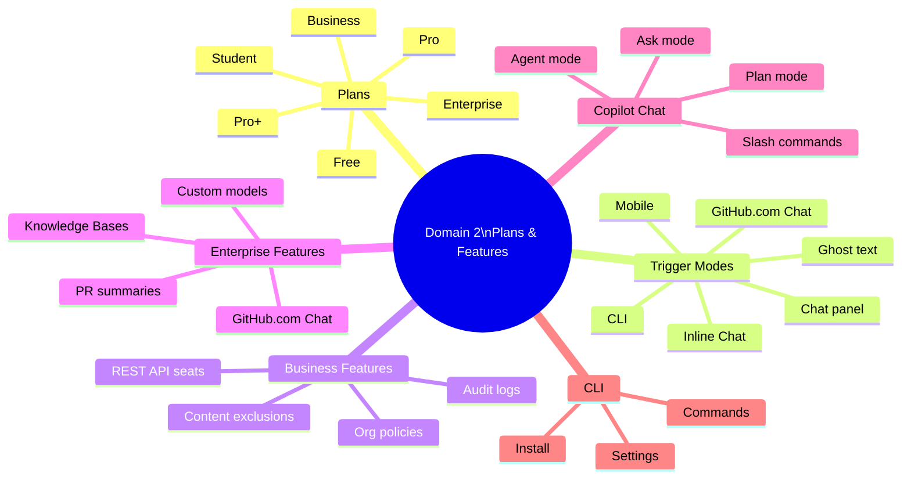

# Domain 2: GitHub Copilot Plans and Features (31%)

[Home](../../README.md)

## Mind Map

## Plans Comparison Table

| Feature | Free | Student | Pro | Pro+ | Business | Enterprise |
|---------|------|---------|-----|------|----------|------------|
| Inline completions | Limited | Unlimited | Unlimited | Unlimited | Unlimited | Unlimited |
| Copilot Chat (IDE) | Limited | ✅ | ✅ | ✅ | ✅ | ✅ |
| Premium models in Chat | ❌ | ✅ | ✅ | ✅ (highest) | ✅ | ✅ |
| Cloud agent | ❌ | ❌ | ✅ | ✅ | ✅ | ✅ |
| Org policy management | ❌ | ❌ | ❌ | ❌ | ✅ | ✅ |
| Content exclusions | ❌ | ❌ | ❌ | ❌ | ✅ | ✅ |
| Audit logs | ❌ | ❌ | ❌ | ❌ | ✅ | ✅ |
| REST API seat management | ❌ | ❌ | ❌ | ❌ | ✅ | ✅ |
| IP indemnity | ❌ | ❌ | ❌ | ❌ | ✅ | ✅ |
| GitHub.com Chat | ❌ | ❌ | ❌ | ❌ | ❌ | ✅ |
| PR summaries | ❌ | ❌ | ❌ | ❌ | ❌ | ✅ |
| Knowledge Bases | ❌ | ❌ | ❌ | ❌ | ❌ | ✅ |
| Custom models | ❌ | ❌ | ❌ | ❌ | ❌ | ✅ |
| Requires GitHub Enterprise Cloud | ❌ | ❌ | ❌ | ❌ | ❌ | ✅ |
| Telemetry default | ON | ON | ON | ON | OFF | OFF |
| Billing | Personal | Free | Personal | Personal | Org seat | Org seat |

## Domain Cheat Sheet

- **Highest exam weight** — 31%; expect scenario questions asking which plan fits a described need.
- Business does **not** require GitHub Enterprise Cloud; Enterprise **does**.
- Telemetry (prompt/suggestion collection) is **ON by default** for individual plans; **OFF by default** for Business/Enterprise.
- IP indemnity is available on **Business and Enterprise only**.
- **GitHub.com Chat, PR summaries, Knowledge Bases, and custom models** are Enterprise-exclusive.
- Content exclusions use **fnmatch (glob) patterns**, not regex; enterprise rules override org rules override repo rules.
- Audit logs retain events for **180 days**; stream to SIEM for longer retention.
- Audit log filter: `action:copilot` for plan events; `actor:Copilot` for agent activity.
- **Four trigger modes**: ghost text (passive), inline Chat (`Ctrl+I`), Chat panel (sidebar), CLI.
- Slash commands work in Chat panel and inline Chat: `/explain`, `/fix`, `/tests`, `/doc`, `/simplify`.
- CLI install: `gh extension install github/gh-copilot`; auth via `gh auth login`.

## Subtopics

- [Copilot Plans Overview](./copilot-plans-overview.md)
- [Copilot Individual](./copilot-individual.md)
- [Copilot Business](./copilot-business.md)
- [Copilot Enterprise](./copilot-enterprise.md)
- [Copilot Chat](./copilot-chat.md)
- [Copilot CLI](./copilot-cli.md)
