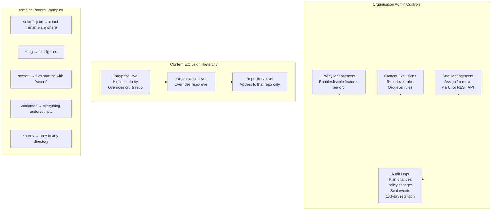

# GitHub Copilot Business

> Learning Objective: Demonstrate how to configure content exclusions and organisation-wide policies, explain the purpose and structure of Copilot Business audit logs, and describe how to manage Business subscriptions through the REST API.

[Home](../../README.md) | [Domain Index](./README.md) | [Previous](./copilot-individual.md) | [Next](./copilot-enterprise.md)

## Exam Relevance

- Domain weight: 31%
- Why it matters: Copilot Business is the go-to plan for teams and mid-market companies. The exam tests practical knowledge of its governance features — specifically how admins exclude files, set policies, interpret audit logs, and automate seat management via API. These are common real-world admin tasks that map directly to exam scenarios.

## Key Concepts

- **Copilot Business** is available to organisations on GitHub Free, GitHub Team, or GitHub Enterprise Cloud (without Enterprise-tier Copilot). It adds org-level governance on top of the core IDE experience.
- **Content exclusions** prevent Copilot from reading specific files as context for completions or Chat. Exclusions can be configured at the repository level, organisation level, or enterprise level — with enterprise-level rules overriding all others.
- **File path pattern matching** in exclusion rules uses **fnmatch notation** (case-insensitive). Patterns such as `secrets.json`, `*.cfg`, `secret*`, and `/scripts/**` are supported.
- **Organisation-wide policy management** lets admins enable or disable specific Copilot features (e.g., Copilot Chat, inline suggestions, agent mode, specific AI models) for all members of their organisation.
- **Audit logs** record changes to Copilot plan settings, policy changes, and seat assignment events. They do **not** capture individual prompt content or chat session data.
- **Audit log retention** is 180 days. For longer retention, organisations should stream the audit log to a SIEM platform.
- **REST API** allows programmatic management of Copilot Business seat assignments — useful for automating provisioning as team members join or leave.
- **Telemetry defaults:** On Business, prompt and suggestion collection is **off by default**; the org admin can choose to enable it.

## Visual Model

Notes:
- The exclusion hierarchy means enterprise owners have the final say; org admins cannot override enterprise rules.
- Audit logs cover *administrative* events only — individual developer prompt content is never logged.
- REST API seat management is the preferred approach for organisations with automated onboarding pipelines.
- Changes to content exclusions can take up to 30 minutes to propagate to IDEs already running; a window reload forces immediate sync.

## Quick Recap

- Copilot Business adds org governance on top of IDE features: content exclusions, policy management, audit logs, and REST API seat management.
- Content exclusions use fnmatch pattern matching and can be set at repository, organisation, or enterprise level; enterprise rules take highest priority.
- Audit logs record plan administration events only (seat changes, policy updates) — not individual prompt content — and are retained for 180 days.
- Search audit events with `action:copilot` (plan events) or `action:copilot.cfb_seat_assignment_created` (specific event type).
- REST API enables programmatic seat provisioning, useful for automated onboarding workflows.
- Prompt/suggestion telemetry is **off by default** on Business plans; the org admin controls whether to enable it.

## Sources Consulted

- https://docs.github.com/en/copilot/get-started/plans
- https://docs.github.com/en/copilot/managing-copilot/managing-github-copilot-in-your-organization/setting-policies-for-copilot-in-your-organization/excluding-content-from-github-copilot
- https://docs.github.com/en/copilot/managing-copilot/managing-github-copilot-in-your-organization/reviewing-activity-related-to-github-copilot-in-your-organization/reviewing-audit-logs-for-copilot-business
- https://docs.github.com/en/copilot/managing-copilot/managing-github-copilot-in-your-organization/setting-policies-for-copilot-in-your-organization/managing-policies-for-copilot-in-your-organization

## References

- Facts referenced; explanations are original.
- https://docs.github.com/en/copilot/managing-copilot/managing-github-copilot-in-your-organization/setting-policies-for-copilot-in-your-organization/excluding-content-from-github-copilot
- https://docs.github.com/en/copilot/managing-copilot/managing-github-copilot-in-your-organization/reviewing-activity-related-to-github-copilot-in-your-organization/reviewing-audit-logs-for-copilot-business

[Home](../../README.md) | [Domain Index](./README.md) | [Previous](./copilot-individual.md) | [Next](./copilot-enterprise.md)
