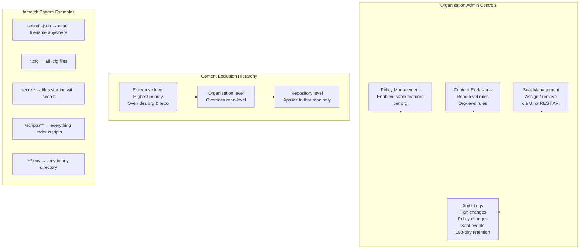

# GitHub Copilot Business

> Learning Objective: Demonstrate how to configure content exclusions and organisation-wide policies, explain the purpose and structure of Copilot Business audit logs, and describe how to manage Business subscriptions through the REST API.

[Home](../../README.md) | [Domain Index](./README.md) | [Previous](./copilot-individual.md) | [Next](./copilot-enterprise.md)

## Exam Relevance

- Domain weight: 31%
- Why it matters: Copilot Business is the go-to plan for teams and mid-market companies. The exam tests practical knowledge of its governance features — specifically how admins exclude files, set policies, interpret audit logs, and automate seat management via API. These are common real-world admin tasks that map directly to exam scenarios.

## Key Concepts

- **Copilot Business** is available to organisations on GitHub Free, GitHub Team, or GitHub Enterprise Cloud (without Enterprise-tier Copilot). It adds org-level governance on top of the core IDE experience.
- **Content exclusions** prevent Copilot from reading specific files as context for completions or Chat. Exclusions can be configured at the repository level, organisation level, or enterprise level — with enterprise-level rules overriding all others.
- **File path pattern matching** in exclusion rules uses **fnmatch notation** (case-insensitive). Patterns such as `secrets.json`, `*.cfg`, `secret*`, and `/scripts/**` are supported.
- **Organisation-wide policy management** lets admins enable or disable specific Copilot features (e.g., Copilot Chat, inline suggestions, agent mode, specific AI models) for all members of their organisation.
- **Audit logs** record changes to Copilot plan settings, policy changes, and seat assignment events. They do **not** capture individual prompt content or chat session data.
- **Audit log retention** is 180 days. For longer retention, organisations should stream the audit log to a SIEM platform.
- **REST API** allows programmatic management of Copilot Business seat assignments — useful for automating provisioning as team members join or leave.
- **Telemetry defaults:** On Business, prompt and suggestion collection is **off by default**; the org admin can choose to enable it.

## Visual Model



Notes:
- The exclusion hierarchy means enterprise owners have the final say; org admins cannot override enterprise rules.
- Audit logs cover *administrative* events only — individual developer prompt content is never logged.
- REST API seat management is the preferred approach for organisations with automated onboarding pipelines.
- Changes to content exclusions can take up to 30 minutes to propagate to IDEs already running; a window reload forces immediate sync.

## Practical Examples and Scenarios

### Example 1: Configuring file exclusions to protect secrets

- Context: A company stores infrastructure secrets in `.env` files and AWS credential files scattered across multiple repositories. They don't want Copilot to ever read these as context.
- Action: The org admin navigates to **Organisation Settings → Copilot → Content Exclusion** and adds the following org-level rule:
  ```yaml
  "*":
    - "**/.env"
    - "**/.aws/credentials"
    - "**/secrets/**"
  ```
- Outcome: These patterns use fnmatch notation to exclude all `.env` files, all AWS credentials files, and any file inside a `secrets/` directory — across every repository in the organisation and any non-Git filesystem paths.

### Example 2: Enforcing a policy to disable Copilot Chat for one team

- Context: The legal department has flagged concerns about Chat being used in a regulated repository. The admin wants to turn off Chat without affecting other repositories.
- Action: They go to **Organisation Settings → Copilot → Policies** and set the "Copilot Chat in the IDE" policy to **Disabled** for the organisation. If a more granular approach is needed (per-repository), enterprise-level policies can be layered.
- Outcome: All organisation members lose access to the Chat panel in their IDEs. Inline suggestions remain unaffected because they are a separate policy toggle.

### Example 3: Searching audit logs for seat assignment events

- Context: A security audit requires a list of everyone who received or lost a Copilot Business licence in the past 90 days.
- Action: The enterprise owner navigates to **Enterprise Settings → Audit Log** and uses the search query: `action:copilot.cfb_seat_assignment_created` to find all seat-grant events, and `action:copilot.cfb_seat_assignment_removed` for revocations.
- Outcome: A filtered list of seat events is returned with timestamps, actor, and affected user — satisfying the audit requirement.

### Example 4: Managing seats via the REST API

- Context: A company's HR system automatically triggers a webhook when new engineers join. They want Copilot seats assigned automatically.
- Action: The automation calls the GitHub REST API endpoint `POST /orgs/{org}/copilot/billing/selected_users` with the new user's login, authenticated using a token with the `manage_billing:copilot` scope.
- Outcome: The new employee's GitHub account is immediately provisioned with a Copilot Business seat without the admin manually visiting the GitHub UI.

## Hands-on Practice Checklist

- [ ] As an org admin, navigate to **Organisation Settings → Copilot → Content Exclusion** and add a test pattern (`*.test-exclude`) to observe how the exclusion UI works.
- [ ] Open a file matching your exclusion pattern in VS Code; confirm no inline suggestion appears and that Chat cannot reference the file.
- [ ] Visit **Organisation Settings → Copilot → Policies** and identify at least five feature toggles available to the admin.
- [ ] Navigate to **Enterprise Settings → Audit Log**, search using `action:copilot` and review the event types that appear.
- [ ] Review the GitHub REST API docs for `GET /orgs/{org}/copilot/billing/seats` and understand the response structure for seat listing.
- [ ] Reload content exclusions in VS Code after making a change (Command Palette → `Developer: Reload Window`) to verify the change takes effect.

## Common Mistakes and Troubleshooting

- Mistake: Expecting audit logs to contain individual chat prompt content.
  Fix: Audit logs only record administrative actions (policy changes, seat events). Prompt-level data is never captured in audit logs; capturing that requires a custom solution (e.g., Copilot CLI hooks).

- Mistake: Adding exclusion patterns and expecting them to take effect immediately.
  Fix: Exclusion settings can take up to 30 minutes to propagate. Force an IDE reload to apply changes sooner.

- Mistake: Using regex syntax in exclusion patterns instead of fnmatch.
  Fix: GitHub content exclusions use fnmatch (glob-style) pattern matching, not regular expressions. For example, use `*.cfg` not `.*\.cfg`.

- Mistake: Thinking organisation-level exclusions override enterprise-level ones.
  Fix: Enterprise-level exclusions have the highest priority and cannot be overridden by organisation or repository settings. The hierarchy flows enterprise → organisation → repository.

- Mistake: Confusing the `action:copilot` audit log filter with `actor:Copilot`.
  Fix: `action:copilot` finds events *about* the Copilot plan (settings, seats). `actor:Copilot` finds events *performed by* the Copilot agent (agentic activity in repositories).

## Quick Recap

- Copilot Business adds org governance on top of IDE features: content exclusions, policy management, audit logs, and REST API seat management.
- Content exclusions use fnmatch pattern matching and can be set at repository, organisation, or enterprise level; enterprise rules take highest priority.
- Audit logs record plan administration events only (seat changes, policy updates) — not individual prompt content — and are retained for 180 days.
- Search audit events with `action:copilot` (plan events) or `action:copilot.cfb_seat_assignment_created` (specific event type).
- REST API enables programmatic seat provisioning, useful for automated onboarding workflows.
- Prompt/suggestion telemetry is **off by default** on Business plans; the org admin controls whether to enable it.

## Practice Questions

1. An organisation admin adds `**/.env` to the org-level content exclusion list. Where does this pattern apply?
   - Answer: To all `.env` files across all filesystem roots (Git and non-Git) for all users managed by that organisation.
   - Rationale: The `"*":` prefix in org-level exclusion rules means all repositories and filesystem locations. The `**/.env` fnmatch pattern matches `.env` files in any subdirectory.

2. A developer changes a content exclusion rule in the GitHub UI. How long can it take to propagate to their IDE?
   - Answer: Up to 30 minutes (can be forced immediately by reloading the IDE window).
   - Rationale: Content exclusion settings are fetched by the IDE on a delayed refresh cycle. In VS Code, opening the Command Palette and running `Developer: Reload Window` forces an immediate re-fetch.

3. What search query would you use in the enterprise audit log to find all Copilot-related events?
   - Answer: `action:copilot`
   - Rationale: The `action:copilot` prefix filters the audit log to all events categorised under the Copilot product. For specific events, you can further narrow down with the full event name (e.g., `action:copilot.cfb_seat_assignment_created`).

4. Does a Copilot Business audit log record the text of chat prompts sent by developers?
   - Answer: No. Audit logs do not contain client session data such as individual prompts.
   - Rationale: The audit log captures administrative and agent activity on the GitHub website. Prompt content is client-side data; capturing it requires a custom solution such as Copilot CLI hooks feeding into a logging service.

## Originality Declaration

- This page was written as original instructional content.
- No protected source text was copied verbatim.

## Sources Consulted

- https://docs.github.com/en/copilot/get-started/plans
- https://docs.github.com/en/copilot/managing-copilot/managing-github-copilot-in-your-organization/setting-policies-for-copilot-in-your-organization/excluding-content-from-github-copilot
- https://docs.github.com/en/copilot/managing-copilot/managing-github-copilot-in-your-organization/reviewing-activity-related-to-github-copilot-in-your-organization/reviewing-audit-logs-for-copilot-business
- https://docs.github.com/en/copilot/managing-copilot/managing-github-copilot-in-your-organization/setting-policies-for-copilot-in-your-organization/managing-policies-for-copilot-in-your-organization

## Potential Similarity Risk

- Risk level: Low
- Notes: The fnmatch pattern examples are derived from official doc examples but re-explained in original instructional context. The audit log search terms (`action:copilot`) are product-specific and must be reproduced verbatim for accuracy.

## References

- Facts referenced; explanations are original.
- https://docs.github.com/en/copilot/managing-copilot/managing-github-copilot-in-your-organization/setting-policies-for-copilot-in-your-organization/excluding-content-from-github-copilot
- https://docs.github.com/en/copilot/managing-copilot/managing-github-copilot-in-your-organization/reviewing-activity-related-to-github-copilot-in-your-organization/reviewing-audit-logs-for-copilot-business

[Home](../../README.md) | [Domain Index](./README.md) | [Previous](./copilot-individual.md) | [Next](./copilot-enterprise.md)
