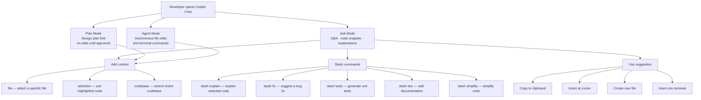

# GitHub Copilot Chat

> Learning Objective: Identify high-value use cases for Copilot Chat, apply techniques to improve response quality, recognise Chat's limitations, use code suggestions effectively, master slash commands, and follow best practices including how to share feedback.

[Home](../../README.md) | [Domain Index](./README.md) | [Previous](./copilot-enterprise.md) | [Next](./copilot-cli.md)

## Exam Relevance

- Domain weight: 31%
- Why it matters: Copilot Chat is the conversational surface that developers interact with daily, and the exam tests detailed knowledge of its capabilities, slash commands, and limitations. Scenarios often describe a task and ask which Chat approach or command is most appropriate, making this a high-frequency question area.

## Key Concepts

- **Copilot Chat** is the conversational AI interface embedded in IDEs (VS Code, JetBrains, Visual Studio, Eclipse, Xcode), on GitHub.com (Enterprise), and in the GitHub mobile app.
- **Three Chat modes in VS Code:** Ask mode (Q&A and code suggestions), Plan mode (detailed implementation plans before any code changes), and Agent mode (autonomous multi-step task execution with file edits and terminal commands).
- **Slash commands** are shorthand directives prefixed with `/` that instruct Chat to perform a specific category of task without needing a full natural-language prompt.
- **Chat context** determines response quality: attaching relevant files (`#file:`), mentioning variables (`#variable:`), specifying the active editor, or selecting a code block before asking dramatically improves relevance.
- **Limitations:** Copilot Chat may produce confidently-stated but incorrect answers (hallucinations), has a finite context window, may not be aware of recent library updates, and cannot access the internet (unless using a web-search-enabled model or tool).
- **Code suggestion options:** Copilot Chat can return code inline in the response; from there, developers can (1) copy it manually, (2) use the "Insert at cursor" button, (3) create a new file from the suggestion, or (4) insert it into the terminal.
- **Feedback:** Developers can use 👍/👎 rating buttons on individual responses, the `/feedback` command (in some interfaces), or the **Help → Report Issue** path in VS Code to report problems.

## Visual Model

Notes:
- Ask mode is the default and covers most day-to-day Q&A tasks.
- Plan mode is designed for large tasks: it researches requirements, drafts a plan, and waits for approval before writing any code.
- Agent mode is the most autonomous — it may run commands and modify multiple files; always review actions before approving.
- Slash commands work in the Chat panel, inline Chat, and (where supported) GitHub.com Chat.

## Quick Recap

- Copilot Chat has three modes: Ask (Q&A), Plan (design-first, no code until approved), Agent (autonomous multi-step execution).
- Slash commands accelerate common tasks: `/explain`, `/fix`, `/tests`, `/doc`, `/simplify`, `/feedback`.
- Context quality drives response quality — use `#file:`, `#selection`, `#codebase`, and `@workspace` to anchor answers.
- Code suggestions can be: copied, inserted at cursor, saved to a new file, or inserted into the terminal.
- Key limitations: training data cutoff (no real-time knowledge), finite context window, potential for hallucinations, no internet access by default.
- Feedback can be given via 👍/👎 on individual responses or through in-IDE reporting tools.

## Sources Consulted

- https://docs.github.com/en/copilot/get-started/features
- https://docs.github.com/en/copilot/using-github-copilot/asking-github-copilot-questions-in-your-ide
- https://docs.github.com/en/copilot/using-github-copilot/asking-github-copilot-questions-in-github

## References

- Facts referenced; explanations are original.
- https://docs.github.com/en/copilot/using-github-copilot/asking-github-copilot-questions-in-your-ide
- https://docs.github.com/en/copilot/get-started/features

[Home](../../README.md) | [Domain Index](./README.md) | [Previous](./copilot-enterprise.md) | [Next](./copilot-cli.md)
