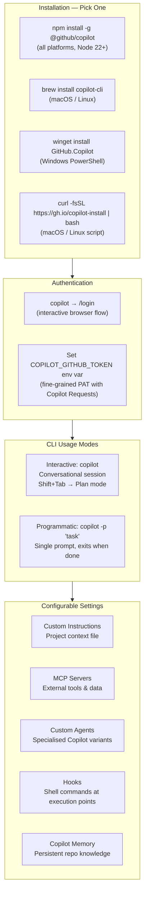

# GitHub Copilot in the CLI

> Learning Objective: Install and authenticate GitHub Copilot CLI, use common commands to complete tasks in the terminal, and configure settings such as custom instructions, MCP servers, and permission controls.

[Home](../../README.md) | [Domain Index](./README.md) | [Previous](./copilot-chat.md) | [Next](./README.md)

## Exam Relevance

- Domain weight: 31%
- Why it matters: The CLI extension is the exam's designated trigger mode for "using Copilot from the terminal." Exam questions test whether candidates know how to install it, which plan tier unlocks it, what it can do (suggest commands, explain commands, run tasks), and how to configure it. This is also a frequent practical scenario in DevOps and backend-heavy teams.

## Key Concepts

- **GitHub Copilot CLI** is an agentic, conversational AI tool for the terminal. It can answer questions, write and modify code, run shell commands on your behalf, and interact with GitHub.com — all from a terminal prompt.
- **Available on all paid plans:** Copilot CLI is accessible with Free, Student, Pro, Pro+, Business, and Enterprise plans. If using an organisation-managed seat, the org admin must have the CLI policy enabled.
- **Two interfaces:** Interactive (start a session with `copilot`) and programmatic (pass a single prompt directly with `copilot -p "..."`).
- **Two modes within interactive:** Default ask/execute mode (the agent carries out tasks), and Plan mode (press `Shift+Tab` to switch — Copilot builds a plan, asks clarifying questions, and waits for approval before writing code).
- **Installation methods:** npm (`npm install -g @github/copilot`), Homebrew (`brew install copilot-cli`), WinGet (`winget install GitHub.Copilot`), a curl/wget install script, or direct download from GitHub releases.
- **Authentication:** On first launch, use `/login` to authenticate with your GitHub account, or set the `COPILOT_GITHUB_TOKEN` (or `GH_TOKEN` / `GITHUB_TOKEN`) environment variable.
- **Configurable settings:** Custom instructions (project context), MCP servers (external tools/data sources), custom agents (specialised variants), hooks (shell commands at execution checkpoints), skills, and Copilot Memory (persistent repository knowledge).
- **Permission model:** By default, Copilot asks for approval before modifying files or running potentially dangerous commands. You can grant specific or full permissions using `--allow-tool`, `--allow-all-tools`, or `--allow-all` — use these flags with caution.

## Visual Model

Notes:
- The `copilot` command is the new standalone CLI; earlier versions used `gh extension install github/gh-copilot` and `gh copilot suggest` / `gh copilot explain` commands. Some exam references may use either approach.
- Plan mode is accessed with `Shift+Tab` from within an interactive session — it does not write code until you approve the plan.
- `--allow-all` grants Copilot the same file-system and shell permissions as your user account — use only in trusted, controlled environments.

## Quick Recap

- GitHub Copilot CLI is available on all paid plans and offers a terminal-native agentic AI experience.
- Install via: `npm install -g @github/copilot`, `brew install copilot-cli`, `winget install GitHub.Copilot`, or install script.
- Authenticate via `/login` on first launch or set the `COPILOT_GITHUB_TOKEN` environment variable.
- Two interfaces: interactive (`copilot`) and programmatic (`copilot -p "..."`); two in-session modes: ask/execute and Plan (Shift+Tab).
- Configurable via: custom instructions, MCP servers, custom agents, hooks, skills, and Copilot Memory.
- Permission model: Copilot asks approval before modifying files or running dangerous commands; `--allow-all-tools` or `--allow-all` can bypass this for automation use cases.

## Sources Consulted

- https://docs.github.com/en/copilot/concepts/agents/about-copilot-cli
- https://docs.github.com/en/copilot/how-tos/set-up/install-copilot-cli
- https://docs.github.com/en/copilot/get-started/features

## References

- Facts referenced; explanations are original.
- https://docs.github.com/en/copilot/concepts/agents/about-copilot-cli
- https://docs.github.com/en/copilot/how-tos/set-up/install-copilot-cli

[Home](../../README.md) | [Domain Index](./README.md) | [Previous](./copilot-chat.md) | [Next](./README.md)
