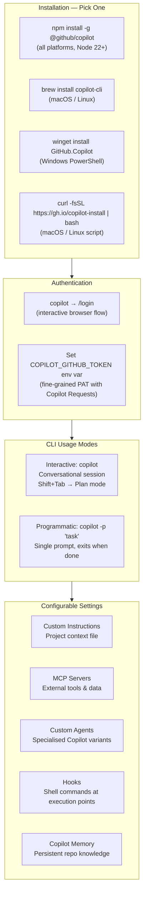

# GitHub Copilot in the CLI

> Learning Objective: Install and authenticate GitHub Copilot CLI, use common commands to complete tasks in the terminal, and configure settings such as custom instructions, MCP servers, and permission controls.

[Home](../../README.md) | [Domain Index](./README.md) | [Previous](./copilot-chat.md) | [Next](./README.md)

## Exam Relevance

- Domain weight: 31%
- Why it matters: The CLI extension is the exam's designated trigger mode for "using Copilot from the terminal." Exam questions test whether candidates know how to install it, which plan tier unlocks it, what it can do (suggest commands, explain commands, run tasks), and how to configure it. This is also a frequent practical scenario in DevOps and backend-heavy teams.

## Key Concepts

- **GitHub Copilot CLI** is an agentic, conversational AI tool for the terminal. It can answer questions, write and modify code, run shell commands on your behalf, and interact with GitHub.com — all from a terminal prompt.
- **Available on all paid plans:** Copilot CLI is accessible with Free, Student, Pro, Pro+, Business, and Enterprise plans. If using an organisation-managed seat, the org admin must have the CLI policy enabled.
- **Two interfaces:** Interactive (start a session with `copilot`) and programmatic (pass a single prompt directly with `copilot -p "..."`).
- **Two modes within interactive:** Default ask/execute mode (the agent carries out tasks), and Plan mode (press `Shift+Tab` to switch — Copilot builds a plan, asks clarifying questions, and waits for approval before writing code).
- **Installation methods:** npm (`npm install -g @github/copilot`), Homebrew (`brew install copilot-cli`), WinGet (`winget install GitHub.Copilot`), a curl/wget install script, or direct download from GitHub releases.
- **Authentication:** On first launch, use `/login` to authenticate with your GitHub account, or set the `COPILOT_GITHUB_TOKEN` (or `GH_TOKEN` / `GITHUB_TOKEN`) environment variable.
- **Configurable settings:** Custom instructions (project context), MCP servers (external tools/data sources), custom agents (specialised variants), hooks (shell commands at execution checkpoints), skills, and Copilot Memory (persistent repository knowledge).
- **Permission model:** By default, Copilot asks for approval before modifying files or running potentially dangerous commands. You can grant specific or full permissions using `--allow-tool`, `--allow-all-tools`, or `--allow-all` — use these flags with caution.

## Visual Model

Notes:
- The `copilot` command is the new standalone CLI; earlier versions used `gh extension install github/gh-copilot` and `gh copilot suggest` / `gh copilot explain` commands. Some exam references may use either approach.
- Plan mode is accessed with `Shift+Tab` from within an interactive session — it does not write code until you approve the plan.
- `--allow-all` grants Copilot the same file-system and shell permissions as your user account — use only in trusted, controlled environments.

## Practical Examples and Scenarios

### Example 1: Installing and authenticating Copilot CLI on macOS

- Context: A developer wants to start using Copilot from their macOS terminal and has Homebrew installed.
- Action: They run `brew install copilot-cli`, then launch `copilot` in their project directory. On the first run, a `/login` prompt appears; they follow the browser-based GitHub OAuth flow to authenticate.
- Outcome: The CLI is installed and authenticated. The developer can now type natural-language tasks and Copilot will work in their project directory.

### Example 2: Using Copilot CLI to generate a shell command

- Context: A developer needs to find all `.log` files larger than 100 MB in a directory tree but cannot remember the exact `find` syntax.
- Action: In an interactive CLI session they type: `Find all .log files larger than 100MB recursively in /var/logs and output their paths`.
- Outcome: Copilot generates the correct `find` command, explains what each flag does, and asks for permission to run it — allowing the developer to review before execution.

### Example 3: Using programmatic mode in a CI script

- Context: A team wants to automatically summarise all commits made this week as part of a weekly report generation script.
- Action: In the CI script they add: `copilot -p "Show me this week's commits and summarise them" --allow-tool='shell(git)'`
- Outcome: Copilot runs the git command, generates a natural-language summary, and outputs it — which the script captures and appends to the weekly report file.

### Example 4: Switching to Plan mode for a complex refactor

- Context: A developer needs to refactor a large authentication module across 8 files. They don't want Copilot to make any changes without a detailed plan first.
- Action: They launch `copilot` in the project directory, then press `Shift+Tab` to enter Plan mode. They describe the refactoring goal; Copilot asks clarifying questions about scope and outputs a numbered plan. The developer reviews it, makes notes, and clicks **Start Implementation**.
- Outcome: Copilot executes the refactor in agent mode, following the approved plan. The developer retains full control via permission prompts before each file modification.

## Hands-on Practice Checklist

- [ ] Install Copilot CLI using your preferred method (`npm`, `brew`, `winget`, or the install script).
- [ ] Run `copilot` and complete the `/login` authentication flow with your GitHub account.
- [ ] In an active project directory, type a natural-language code task (e.g., "Add error handling to the main function") and observe the permission prompts before file changes.
- [ ] Use `Shift+Tab` to switch to Plan mode and describe a multi-step task; review the plan output before approving.
- [ ] Run `copilot -p "List my open PRs"` in programmatic mode and observe the output.
- [ ] Add a custom instruction file to your project and verify that Copilot references it in a subsequent session.
- [ ] Run `/context` in an interactive session to view the current token usage breakdown.

## Common Mistakes and Troubleshooting

- Mistake: Using `--allow-all` without reviewing what commands Copilot will run.
  Fix: This flag grants unrestricted file-system and shell access equal to your user account. Only use it in isolated, trusted environments or after carefully reviewing Copilot's proposed plan.

- Mistake: Expecting the CLI to work on an org plan without admin enabling it.
  Fix: If your Copilot seat comes from an organisation, the org admin must enable the Copilot CLI policy in **Organisation Settings → Copilot → Policies**. Without this, the CLI will not work.

- Mistake: Confusing `copilot` (standalone) with `gh copilot` (the older gh extension approach).
  Fix: The current standalone `copilot` CLI is installed independently of the `gh` CLI. The older `gh extension install github/gh-copilot` approach provided a simpler `suggest`/`explain` interface; the new standalone CLI is the current recommended tool with full agentic capabilities.

- Mistake: Starting the CLI in the wrong directory and getting irrelevant responses.
  Fix: The CLI's access is scoped to the directory from which it was launched. Always start `copilot` from your project root so it can read the relevant files.

- Mistake: Not using custom instructions, leading to repetitive context-setting.
  Fix: Create a `.copilot/instructions.md` (or equivalent custom instructions file) with project details, tech stack, coding conventions, and build/test commands. This context is automatically included in every session.

## Quick Recap

- GitHub Copilot CLI is available on all paid plans and offers a terminal-native agentic AI experience.
- Install via: `npm install -g @github/copilot`, `brew install copilot-cli`, `winget install GitHub.Copilot`, or install script.
- Authenticate via `/login` on first launch or set the `COPILOT_GITHUB_TOKEN` environment variable.
- Two interfaces: interactive (`copilot`) and programmatic (`copilot -p "..."`); two in-session modes: ask/execute and Plan (Shift+Tab).
- Configurable via: custom instructions, MCP servers, custom agents, hooks, skills, and Copilot Memory.
- Permission model: Copilot asks approval before modifying files or running dangerous commands; `--allow-all-tools` or `--allow-all` can bypass this for automation use cases.

## Practice Questions

1. A developer on a Copilot Business plan tries to use Copilot CLI but gets an access error. What is the most likely cause?
   - Answer: The organisation admin has not enabled the Copilot CLI policy in organisation settings.
   - Rationale: When a Copilot seat is managed by an organisation, the org admin must explicitly enable the CLI feature under **Organisation Settings → Copilot → Policies**. Without this, CLI usage is blocked regardless of plan tier.

2. A developer wants Copilot CLI to build a detailed implementation plan for a large feature before making any code changes. How do they activate Plan mode?
   - Answer: Press `Shift+Tab` from within an interactive CLI session to switch to Plan mode.
   - Rationale: Plan mode is toggled with `Shift+Tab` in the interactive interface. In Plan mode, Copilot analyses the request, asks clarifying questions, and produces a structured plan before executing any code changes.

3. Which command installs Copilot CLI on macOS using Homebrew?
   - Answer: `brew install copilot-cli`
   - Rationale: Homebrew is the supported macOS (and Linux) package manager install path. Other valid options include npm (`npm install -g @github/copilot`), the curl install script, and direct download from GitHub releases.

4. A developer wants to run a single Copilot CLI task from a CI pipeline script without starting an interactive session. Which flag do they use?
   - Answer: `-p` (or `--prompt`), e.g., `copilot -p "task description"`.
   - Rationale: The programmatic interface allows a single prompt to be passed directly on the command line. Copilot completes the task and exits, making it suitable for automation and CI pipeline integration.

## Originality Declaration

- This page was written as original instructional content.
- No protected source text was copied verbatim.

## Sources Consulted

- https://docs.github.com/en/copilot/concepts/agents/about-copilot-cli
- https://docs.github.com/en/copilot/how-tos/set-up/install-copilot-cli
- https://docs.github.com/en/copilot/get-started/features

## Potential Similarity Risk

- Risk level: Low
- Notes: Command strings (`npm install -g @github/copilot`, `brew install copilot-cli`, etc.) are exact commands required for accuracy. All conceptual explanations, scenarios, and configurable settings descriptions are independently written.

## References

- Facts referenced; explanations are original.
- https://docs.github.com/en/copilot/concepts/agents/about-copilot-cli
- https://docs.github.com/en/copilot/how-tos/set-up/install-copilot-cli

[Home](../../README.md) | [Domain Index](./README.md) | [Previous](./copilot-chat.md) | [Next](./README.md)
