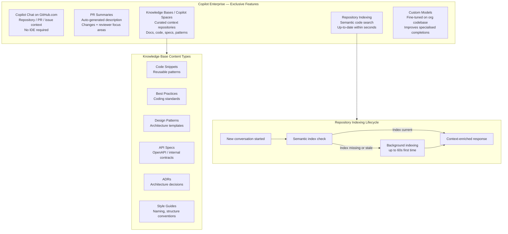

# GitHub Copilot Enterprise

> Learning Objective: Explain the exclusive capabilities of Copilot Enterprise — including Copilot Chat on GitHub.com, PR summaries, Knowledge Bases, repository indexing, and custom models — and describe how each is configured and used.

[Home](../../README.md) | [Domain Index](./README.md) | [Previous](./copilot-business.md) | [Next](./copilot-chat.md)

## Exam Relevance

- Domain weight: 31%
- Why it matters: Copilot Enterprise is the most feature-rich plan and the one most likely to appear in exam scenario questions requiring you to identify which capability requires Enterprise (vs Business). Understanding Knowledge Bases, PR summaries, GitHub.com Chat, and custom models is essential for the highest-difficulty questions in Domain 2.

## Key Concepts

- **Copilot Enterprise** requires GitHub Enterprise Cloud (GHEC). It includes all Business features plus a set of platform-native capabilities that go beyond the IDE.
- **Copilot Chat on GitHub.com** — a conversational AI interface available directly on the GitHub website (not just in IDEs), allowing developers to ask questions in the context of repositories, pull requests, issues, and commits without leaving their browser.
- **Pull request summaries** — Copilot can auto-generate a structured description of a PR's changes (what was changed, which files are affected, what reviewers should focus on) to accelerate code review.
- **Repository indexing** — Copilot creates a semantic code search index for repositories to deliver context-enriched answers. Initial indexing can take up to 60 seconds for large repositories; subsequent updates are near-instant when a new conversation starts.
- **Knowledge Bases (Copilot Spaces)** — the mechanism for organising and centralising relevant content (repositories, documentation, specs, code examples) into a curated context that Copilot can draw from when answering questions. This improves response quality, consistency, and efficiency.
- **Knowledge types in a Knowledge Base:** source code snippets, best-practice documentation, design patterns, architecture decision records (ADRs), API specifications, internal style guides, and plain-text notes.
- **Custom models** — Enterprise allows organisations to fine-tune or configure Copilot to use models trained or adjusted on their own codebase, style, and conventions, improving relevance of completions in specialised domains.
- **Enterprise-level policy control** — Enterprise owners can set policies that cascade down to all organisations in the enterprise and cannot be overridden at the organisation level.

## Visual Model

Notes:
- All Enterprise features sit on top of Business features — there is nothing in Business that Enterprise lacks.
- The GitHub.com Chat interface is the key differentiator most likely to appear in exam questions distinguishing Business from Enterprise.
- PR summaries are generated on demand — Copilot does not automatically post them; the author triggers generation from the PR description editor.
- Repository indexing happens automatically; no admin configuration is required. Content exclusion policies apply to indexed data before it is shared with Copilot.

## Practical Examples and Scenarios

### Example 1: Using Copilot Chat on GitHub.com to explore an unfamiliar codebase

- Context: A new engineer joins a large team and needs to understand how the payment processing module works without cloning the repository locally.
- Action: They navigate to the repository on GitHub.com, open the Copilot Chat interface (available in the sidebar), and ask: "How does this repo manage payment retries and error handling?"
- Outcome: Copilot queries the semantic index of the repository and returns a context-rich answer referencing actual code files, giving the engineer a clear starting point — all without opening an IDE or cloning any code.

### Example 2: Generating a pull request summary

- Context: A developer opens a large pull request with changes across 15 files. They want to help reviewers understand the intent quickly.
- Action: In the PR description field on GitHub.com, they click the Copilot icon in the text editor header and select **Summary**.
- Outcome: Copilot generates a structured summary covering what was changed, which files were most affected, and what reviewers should focus on. The developer reviews it, adds context, and saves the description.

### Example 3: Building a Knowledge Base for an internal framework

- Context: An enterprise team has an internal Python framework with unique conventions. Developers ask Copilot questions using generic Python best practices instead of the team's established patterns.
- Action: An admin creates a Copilot Space (Knowledge Base) containing the framework's source code, the internal style guide Markdown files, a set of usage examples, and the API specification. Team members are given access to the Space.
- Outcome: When developers attach the Space to their Copilot Chat session, responses are grounded in the team's actual framework conventions rather than generic public knowledge. Code suggestions match internal patterns, improving consistency and reducing review feedback cycles.

### Example 4: Custom model for a specialised domain

- Context: A financial services firm uses a proprietary domain-specific language (DSL) for trade calculations that no public model has training data for.
- Action: They configure Copilot Enterprise to use a fine-tuned custom model built on their DSL codebase.
- Outcome: Code completions and Chat responses now reflect accurate DSL syntax and conventions, dramatically reducing the number of invalid suggestions.

## Hands-on Practice Checklist

- [ ] On GitHub.com, navigate to a repository you own and open the Copilot Chat interface from the sidebar; ask a question about the codebase structure.
- [ ] Create a pull request on a branch with several file changes; use the Copilot summary button in the PR description field and review the generated text.
- [ ] In **Organisation Settings → Copilot → Spaces (or Knowledge Bases)**, create a new Space containing at least one repository and one documentation file.
- [ ] Attach your newly created Space to a Copilot Chat session and observe whether responses reference the content you added.
- [ ] Review the repository indexing concept by starting a fresh chat session on a repository and checking whether Copilot references specific code when answering a structural question.

## Common Mistakes and Troubleshooting

- Mistake: Assuming PR summaries are automatically generated and posted without developer input.
  Fix: PR summaries are on-demand only. The PR author must explicitly trigger the summary from the description editor. Copilot does not auto-post summaries.

- Mistake: Believing large repository indexing is instantaneous.
  Fix: Initial indexing of a large repository can take up to 60 seconds. Subsequent updates happen quickly (typically within seconds) when a new conversation begins.

- Mistake: Adding a Knowledge Base (Space) and expecting it to be used automatically for all Copilot interactions.
  Fix: Users must attach the Space to their chat session explicitly, or configure default contexts. Copilot does not automatically apply all Knowledge Bases to every query.

- Mistake: Thinking custom models are available to all plans.
  Fix: Custom model configuration is an Enterprise-tier capability. Business and individual plan users use GitHub's default model offering.

- Mistake: Expecting content exclusion rules to be ignored when semantic indexing is enabled.
  Fix: Content exclusion policies are enforced during indexing. Even if a repository is indexed, excluded content is filtered before being passed to Copilot Chat.

## Quick Recap

- Copilot Enterprise = all Business features + GitHub.com Chat + PR summaries + Knowledge Bases (Spaces) + repository indexing + custom models.
- Copilot Chat on GitHub.com lets developers query repositories directly in the browser without an IDE, using the semantic index for context-enriched answers.
- PR summaries are triggered on-demand in the PR description editor; they summarise changes, affected files, and reviewer focus areas.
- Knowledge Bases (Spaces) curate content types: source code, best practices, design patterns, API specs, ADRs, and style guides; they ground Chat in org-specific knowledge.
- Repository indexing (semantic code search) is automatic; initial indexing takes up to 60 seconds; content exclusions apply to indexed data.
- Custom models allow fine-tuning on an organisation's own codebase, improving completion relevance for specialised or proprietary code.

## Practice Questions

1. Which Copilot Enterprise feature allows a developer to ask questions about a repository directly on GitHub.com without needing an IDE?
   - Answer: Copilot Chat on GitHub.com.
   - Rationale: This is an Enterprise-exclusive capability. The GitHub.com Chat interface provides a browser-native conversational AI experience tied to repository context via semantic indexing.

2. A developer wants Copilot to generate a description of a pull request's changes for reviewers. What must they do?
   - Answer: Open the PR description field, click the Copilot icon, and select Summary.
   - Rationale: PR summaries are not auto-generated — the author must explicitly trigger them from the text editor header in the PR creation/edit form.

3. What types of content can be added to a Knowledge Base (Copilot Space)?
   - Answer: Source code snippets, best-practice documentation, design patterns, API specifications, architecture decision records (ADRs), style guides, and general-purpose Markdown or text content.
   - Rationale: Spaces act as curated context stores; any reference material the team wants Copilot to reason from can be included to improve response quality and consistency.

4. How long does initial repository indexing take for a large repository?
   - Answer: Up to 60 seconds for initial indexing; subsequent updates are near-instant (typically within seconds) at the start of a new conversation.
   - Rationale: The semantic index is built in the background. The first-time index creation for a large codebase may take up to a minute, but re-indexing on code changes is designed to be fast.

## Originality Declaration

- This page was written as original instructional content.
- No protected source text was copied verbatim.

## Sources Consulted

- https://docs.github.com/en/copilot/get-started/plans
- https://docs.github.com/en/copilot/get-started/features
- https://docs.github.com/en/copilot/using-github-copilot/creating-a-pull-request-summary-with-github-copilot
- https://docs.github.com/en/copilot/concepts/context/repository-indexing
- https://docs.github.com/en/copilot/using-github-copilot/asking-github-copilot-questions-in-github

## Potential Similarity Risk

- Risk level: Low
- Notes: Feature names and timing figures (60 seconds, "within seconds") are drawn directly from documentation and must be reproduced accurately. All explanations, scenarios, and diagrams are independently written.

## References

- Facts referenced; explanations are original.
- https://docs.github.com/en/copilot/concepts/context/repository-indexing
- https://docs.github.com/en/copilot/using-github-copilot/creating-a-pull-request-summary-with-github-copilot
- https://docs.github.com/en/copilot/using-github-copilot/asking-github-copilot-questions-in-github

[Home](../../README.md) | [Domain Index](./README.md) | [Previous](./copilot-business.md) | [Next](./copilot-chat.md)
