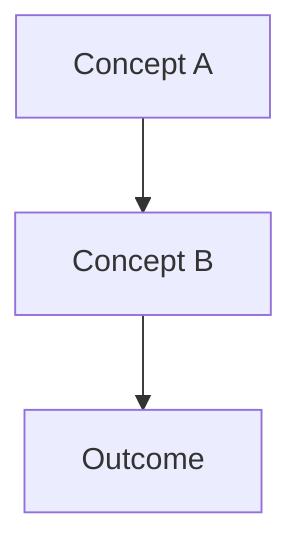

# Domain 2: Copilot Enterprise

> Learning Objective: <!-- One-line statement of what the learner should be able to do after this page. -->

[Home](../../README.md) | [Domain Index](./README.md) | [Previous](./copilot-business.md) | [Next](./copilot-chat.md)

## Exam Relevance

- Domain weight: 31%
- Why it matters: <!-- 2-4 lines on impact for exam and real-world usage -->

## Key Concepts

- <!-- Original explanation point 1 -->
- <!-- Original explanation point 2 -->
- <!-- Original explanation point 3 -->

## Visual Model

Notes:
- <!-- Explain the diagram in 2-4 bullets -->

## Practical Examples and Scenarios

### Example 1: <!-- Scenario title -->

- Context: <!-- Brief setup -->
- Action: <!-- What to do -->
- Outcome: <!-- Expected result -->

### Example 2: <!-- Scenario title -->

- Context: <!-- Brief setup -->
- Action: <!-- What to do -->
- Outcome: <!-- Expected result -->

## Hands-on Practice Checklist

- [ ] <!-- Task 1 -->
- [ ] <!-- Task 2 -->
- [ ] <!-- Task 3 -->

## Common Mistakes and Troubleshooting

- Mistake: <!-- Issue -->
  Fix: <!-- Resolution -->
- Mistake: <!-- Issue -->
  Fix: <!-- Resolution -->

## Quick Recap

- <!-- Recap bullet 1 -->
- <!-- Recap bullet 2 -->
- <!-- Recap bullet 3 -->

## Practice Questions

1. <!-- Original question 1 -->
   - Answer: <!-- Correct answer -->
   - Rationale: <!-- Why this answer is correct -->
2. <!-- Original question 2 -->
   - Answer: <!-- Correct answer -->
   - Rationale: <!-- Why this answer is correct -->

## Originality Declaration

- This page was written as original instructional content.
- No protected source text was copied verbatim.

## Sources Consulted

- <!-- Official source URL 1 -->
- <!-- Official source URL 2 -->

## Potential Similarity Risk

- Risk level: <!-- Low/Medium/High -->
- Notes: <!-- If any section may be close to source phrasing, mention it and rewrite before finalizing. -->

## References

- Facts referenced; explanations are original.
- <!-- Reference URL 1 -->
- <!-- Reference URL 2 -->

[Home](../../README.md) | [Domain Index](./README.md) | [Previous](./copilot-business.md) | [Next](./copilot-chat.md)
