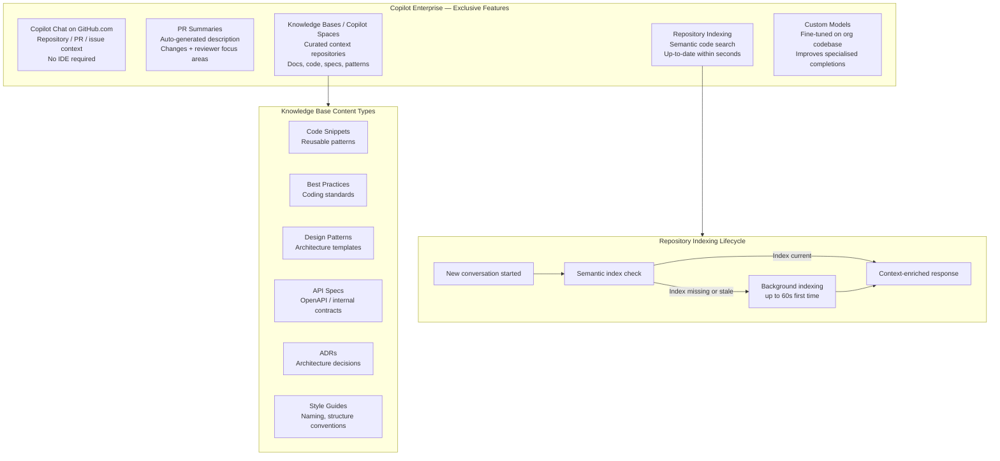

# GitHub Copilot Enterprise

> Learning Objective: Explain the exclusive capabilities of Copilot Enterprise — including Copilot Chat on GitHub.com, PR summaries, Knowledge Bases, repository indexing, and custom models — and describe how each is configured and used.

[Home](../../README.md) | [Domain Index](./README.md) | [Previous](./copilot-business.md) | [Next](./copilot-chat.md)

## Exam Relevance

- Domain weight: 31%
- Why it matters: Copilot Enterprise is the most feature-rich plan and the one most likely to appear in exam scenario questions requiring you to identify which capability requires Enterprise (vs Business). Understanding Knowledge Bases, PR summaries, GitHub.com Chat, and custom models is essential for the highest-difficulty questions in Domain 2.

## Key Concepts

- **Copilot Enterprise** requires GitHub Enterprise Cloud (GHEC). It includes all Business features plus a set of platform-native capabilities that go beyond the IDE.
- **Copilot Chat on GitHub.com** — a conversational AI interface available directly on the GitHub website (not just in IDEs), allowing developers to ask questions in the context of repositories, pull requests, issues, and commits without leaving their browser.
- **Pull request summaries** — Copilot can auto-generate a structured description of a PR's changes (what was changed, which files are affected, what reviewers should focus on) to accelerate code review.
- **Repository indexing** — Copilot creates a semantic code search index for repositories to deliver context-enriched answers. Initial indexing can take up to 60 seconds for large repositories; subsequent updates are near-instant when a new conversation starts.
- **Knowledge Bases (Copilot Spaces)** — the mechanism for organising and centralising relevant content (repositories, documentation, specs, code examples) into a curated context that Copilot can draw from when answering questions. This improves response quality, consistency, and efficiency.
- **Knowledge types in a Knowledge Base:** source code snippets, best-practice documentation, design patterns, architecture decision records (ADRs), API specifications, internal style guides, and plain-text notes.
- **Custom models** — Enterprise allows organisations to fine-tune or configure Copilot to use models trained or adjusted on their own codebase, style, and conventions, improving relevance of completions in specialised domains.
- **Enterprise-level policy control** — Enterprise owners can set policies that cascade down to all organisations in the enterprise and cannot be overridden at the organisation level.

## Visual Model

Notes:
- All Enterprise features sit on top of Business features — there is nothing in Business that Enterprise lacks.
- The GitHub.com Chat interface is the key differentiator most likely to appear in exam questions distinguishing Business from Enterprise.
- PR summaries are generated on demand — Copilot does not automatically post them; the author triggers generation from the PR description editor.
- Repository indexing happens automatically; no admin configuration is required. Content exclusion policies apply to indexed data before it is shared with Copilot.

## Key Terms

- **GitHub Enterprise Cloud (GHEC)**: The enterprise GitHub hosting tier required to purchase Copilot Enterprise.
- **Knowledge Base**: A curated collection of repository content indexed by Copilot Enterprise to ground Chat responses in org-specific context.
- **Semantic index**: A vector-based search index built from repository content; enables Copilot to find relevant code/docs beyond exact keyword matching.
- **PR summary**: An on-demand Copilot-generated summary of a pull request's changes, generated from the diff.
- **Custom model**: A fine-tuned AI model trained on org-specific code, available as an alternative to the default model in Copilot Enterprise.
- **Knowledge Base types**: Supported content includes code snippets, best practices, design patterns, ADRs, API specs, and style guides.
- **Indexing latency**: Initial repo index takes ~60 seconds; incremental updates are near-instant.

## Cheat Sheet

| Feature | Enterprise only? | Notes |
|---------|-----------------|-------|
| GitHub.com Chat | ✅ | Available on GitHub.com website |
| PR summaries | ✅ | On-demand, user-triggered from PR page |
| Knowledge Bases | ✅ | Requires repo semantic indexing |
| Custom models | ✅ | Fine-tuned on org code |
| Requires GHEC | ✅ | Cannot buy Enterprise without GHEC |
| Content exclusions | Shared with Business | Exclusions apply to KB indexing too |
| Audit logs | Shared with Business | Same 180-day retention |

**Knowledge Base content types**: code snippets · best practices · design patterns · ADRs · API specs · style guides

- Initial semantic index: ~60 seconds; incremental updates: seconds.
- Content exclusions affect what gets indexed into Knowledge Bases.
- PR summaries are triggered per PR by the user — they are not automatic.

## Quick Recap

- Copilot Enterprise = all Business features + GitHub.com Chat + PR summaries + Knowledge Bases (Spaces) + repository indexing + custom models.
- Copilot Chat on GitHub.com lets developers query repositories directly in the browser without an IDE, using the semantic index for context-enriched answers.
- PR summaries are triggered on-demand in the PR description editor; they summarise changes, affected files, and reviewer focus areas.
- Knowledge Bases (Spaces) curate content types: source code, best practices, design patterns, API specs, ADRs, and style guides; they ground Chat in org-specific knowledge.
- Repository indexing (semantic code search) is automatic; initial indexing takes up to 60 seconds; content exclusions apply to indexed data.
- Custom models allow fine-tuning on an organisation's own codebase, improving completion relevance for specialised or proprietary code.

## Sources Consulted

- https://docs.github.com/en/copilot/get-started/plans
- https://docs.github.com/en/copilot/get-started/features
- https://docs.github.com/en/copilot/using-github-copilot/creating-a-pull-request-summary-with-github-copilot
- https://docs.github.com/en/copilot/concepts/context/repository-indexing
- https://docs.github.com/en/copilot/using-github-copilot/asking-github-copilot-questions-in-github

## References

- Facts referenced; explanations are original.
- https://docs.github.com/en/copilot/concepts/context/repository-indexing
- https://docs.github.com/en/copilot/using-github-copilot/creating-a-pull-request-summary-with-github-copilot
- https://docs.github.com/en/copilot/using-github-copilot/asking-github-copilot-questions-in-github

[Home](../../README.md) | [Domain Index](./README.md) | [Previous](./copilot-business.md) | [Next](./copilot-chat.md)
