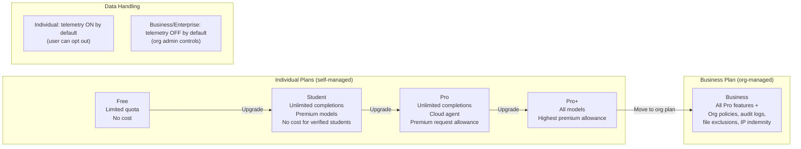

# GitHub Copilot Individual Plans

> Learning Objective: Identify the features available in each individual-tier Copilot plan (Free, Student, Pro, Pro+) and explain the key differences from the Business plan in terms of data handling, IP indemnity, billing, and available IDE features.

[Home](../../README.md) | [Domain Index](./README.md) | [Previous](./copilot-plans-overview.md) | [Next](./copilot-business.md)

## Exam Relevance

- Domain weight: 31%
- Why it matters: Exam questions frequently test your ability to distinguish individual plans from organisational plans. Understanding data exclusion behaviour, IP indemnity eligibility, billing models, and available IDE tooling for individual users is essential for scenario-based questions about privacy, cost, and feature availability.

## Key Concepts

- **Four individual plan tiers:** Free (limited monthly quota), Student (no cost for verified students), Pro (paid unlimited), and Pro+ (paid, highest premium-request allowance with access to all available models).
- **Individual plans are self-managed:** Users activate, manage, and pay for these plans through their personal GitHub account settings — no organisation owner involvement is required.
- **Data handling for individual plans:** By default, Copilot Individual plans may use prompts and suggestions to improve GitHub's AI models *unless* the user explicitly opts out in their settings. This differs from Business and Enterprise, where telemetry collection is **off by default** and controlled at the org level.
- **IP indemnity:** Copilot Business and Enterprise include IP indemnity protection (GitHub's Copilot Copyright Commitment) as part of their terms. Individual plan users should review their plan terms — the commitment applies differently across tiers.
- **Billing model:** Individual plans are billed per person directly to the GitHub user's payment method. Business/Enterprise plans are billed per seat through an organisation, enabling centralised invoicing.
- **IDE feature availability:** Core features — inline completions, inline Chat, Chat panel, CLI, and mobile — are available across all paid individual plans. Pro+ additionally includes access to every available model (e.g., GPT-4.5, Claude 3.7 Sonnet, Gemini) in Chat.
- **No org policy controls:** Individual plans do not have access to organisation-level features like content exclusion rules, audit logs, or seat assignment — those are exclusive to Business and Enterprise.

## Visual Model

Notes:
- The four individual tiers form a progression from limited free access up to maximum model availability.
- The jump from Pro+ to Business is not just a feature upgrade — it shifts the billing and governance model entirely from personal to organisational.
- Data handling is a key differentiator: individual users must opt out of telemetry; organisations have it off by default.

## Practical Examples and Scenarios

### Example 1: Student selecting the right individual plan

- Context: A verified computer science student wants full Copilot access including premium AI models to help with coursework and personal projects, at no cost.
- Action: They visit GitHub's student developer pack verification page, confirm their student status, and activate Copilot Student on their personal account.
- Outcome: They receive unlimited inline completions, access to premium Chat models, the cloud agent capability, and a monthly premium-request allowance — functionally equivalent to Copilot Pro — at no charge.

### Example 2: Individual developer opting out of prompt telemetry

- Context: A freelance developer on Copilot Pro is concerned that their client's proprietary code patterns may be used to train GitHub's models.
- Action: They navigate to **github.com/settings/copilot** and disable the "Allow GitHub to use my code snippets for product improvements" toggle (the prompt and suggestion collection setting).
- Outcome: Their prompts and Copilot responses are no longer retained for model training. Note: this does not apply organisational policies — if they need guaranteed org-wide exclusions, they would need Business plan.

### Example 3: Comparing IDE features between Pro and Business

- Context: A developer is deciding whether to subscribe to Pro individually or whether their team should move to Business.
- Action: They compare the feature tables: both plans provide inline suggestions, inline Chat, Chat panel, CLI extension, and mobile. Business adds content exclusion rules, org policy management, audit logs, and formal IP indemnity terms.
- Outcome: For an individual working alone, Pro is sufficient. For a team where an admin needs to enforce consistent policies and protect the company legally, Business is the right choice.

## Hands-on Practice Checklist

- [ ] Navigate to **github.com/settings/copilot** and locate the "Policies" section; identify the prompt and suggestion collection toggle.
- [ ] Toggle the "Allow GitHub to use my data for product improvements" option off and back on to observe where individual data controls live.
- [ ] In VS Code, open the Command Palette (`Ctrl+Shift+P`) and search for "Copilot" to see the full list of available Copilot IDE commands on your current plan.
- [ ] Compare the model selector in the Copilot Chat panel — note which models are available. Pro users see a curated set; Pro+ users see all available models.
- [ ] If you have a Pro or Pro+ account, run `gh copilot suggest` and `gh copilot explain` in the terminal to confirm CLI access.

## Common Mistakes and Troubleshooting

- Mistake: Believing individual plan users automatically have IP indemnity on par with Business.
  Fix: GitHub's Copilot Copyright Commitment (IP indemnity) is most explicitly defined for Business and Enterprise. Individual users should review the current terms for their plan tier.

- Mistake: Assuming opting out of telemetry on an individual plan is the same as content exclusions on Business.
  Fix: The individual telemetry toggle controls whether prompts are used for model training; content exclusions in Business prevent certain files from ever being read by Copilot as context. These are distinct mechanisms.

- Mistake: Thinking Pro+ and Pro offer the same model access.
  Fix: Pro provides a curated set of models in Chat (with a monthly premium-request allowance); Pro+ provides access to all available models and a larger premium-request allowance.

- Mistake: Expecting to manage other users' Copilot access on an individual plan.
  Fix: Individual plans have no seat-management capability. Assigning Copilot to team members requires upgrading to Copilot Business or Enterprise.

## Quick Recap

- Individual plans: Free (limited), Student (free for verified students), Pro (paid unlimited), Pro+ (all models, largest allowance).
- All individual plans are self-managed and billed to a personal GitHub account.
- Key differences vs Business: data handling defaults (individual = telemetry on by default, user opts out; Business = off by default, org controls), IP indemnity terms, billing model (personal vs org), and absence of org governance features (policies, audit logs, content exclusions).
- All paid individual plans include inline completions, inline Chat, Chat panel, CLI extension, and mobile; Pro+ adds full model access.
- Individual plans do not include org-level policy management, audit logs, or file exclusion rules.

## Practice Questions

1. By default, does GitHub use a Copilot Pro user's prompts and suggestions for model improvement?
   - Answer: Yes, by default — but the user can opt out in their personal Copilot settings.
   - Rationale: Individual plans collect prompt and suggestion telemetry by default. The user must explicitly disable the setting at **github.com/settings/copilot**. This contrasts with Business/Enterprise, where collection is off by default.

2. A solo freelance developer wants unlimited Copilot completions and the ability to access every available AI model in Copilot Chat. Which individual plan should they subscribe to?
   - Answer: Copilot Pro+.
   - Rationale: Pro includes unlimited completions and a premium-request allowance but not full access to every model. Pro+ provides the full model catalogue and the highest premium-request allowance.

3. Which of the following features is NOT available on Copilot Pro but IS available on Copilot Business?
   - Answer: Organisation-wide content exclusion rules (and organisation policy management / audit logs).
   - Rationale: Content exclusions, org-level policies, and audit logs are Business and Enterprise features. Pro is an individual plan with no organisation governance capabilities.

4. A verified teacher wants free access to Copilot Pro. Is this possible?
   - Answer: Yes — verified teachers may be eligible for free Copilot Pro access under GitHub's educator program.
   - Rationale: GitHub extends free Copilot Pro access to verified teachers and maintainers of popular open-source projects, in addition to verified students (who receive Copilot Student).

## Originality Declaration

- This page was written as original instructional content.
- No protected source text was copied verbatim.

## Sources Consulted

- https://docs.github.com/en/copilot/get-started/plans
- https://docs.github.com/en/copilot/get-started/features
- https://docs.github.com/en/copilot/managing-copilot/managing-copilot-as-an-individual-subscriber/managing-copilot-policies-as-an-individual-subscriber

## Potential Similarity Risk

- Risk level: Low
- Notes: Plan tier names and feature names are product terms. All explanations, comparisons, and scenarios are independently written. The data-handling contrast is based on documented public policy differences.

## References

- Facts referenced; explanations are original.
- https://docs.github.com/en/copilot/get-started/plans
- https://docs.github.com/en/copilot/managing-copilot/managing-copilot-as-an-individual-subscriber/managing-copilot-policies-as-an-individual-subscriber

[Home](../../README.md) | [Domain Index](./README.md) | [Previous](./copilot-plans-overview.md) | [Next](./copilot-business.md)
