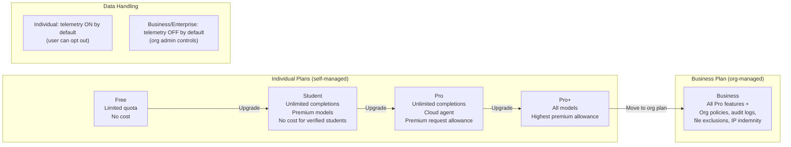

# GitHub Copilot Individual Plans

> Learning Objective: Identify the features available in each individual-tier Copilot plan (Free, Student, Pro, Pro+) and explain the key differences from the Business plan in terms of data handling, IP indemnity, billing, and available IDE features.

[Home](../../README.md) | [Domain Index](./README.md) | [Previous](./copilot-plans-overview.md) | [Next](./copilot-business.md)

## Exam Relevance

- Domain weight: 31%
- Why it matters: Exam questions frequently test your ability to distinguish individual plans from organisational plans. Understanding data exclusion behaviour, IP indemnity eligibility, billing models, and available IDE tooling for individual users is essential for scenario-based questions about privacy, cost, and feature availability.

## Key Concepts

- **Four individual plan tiers:** Free (limited monthly quota), Student (no cost for verified students), Pro (paid unlimited), and Pro+ (paid, highest premium-request allowance with access to all available models).
- **Individual plans are self-managed:** Users activate, manage, and pay for these plans through their personal GitHub account settings — no organisation owner involvement is required.
- **Data handling for individual plans:** By default, Copilot Individual plans may use prompts and suggestions to improve GitHub's AI models *unless* the user explicitly opts out in their settings. This differs from Business and Enterprise, where telemetry collection is **off by default** and controlled at the org level.
- **IP indemnity:** Copilot Business and Enterprise include IP indemnity protection (GitHub's Copilot Copyright Commitment) as part of their terms. Individual plan users should review their plan terms — the commitment applies differently across tiers.
- **Billing model:** Individual plans are billed per person directly to the GitHub user's payment method. Business/Enterprise plans are billed per seat through an organisation, enabling centralised invoicing.
- **IDE feature availability:** Core features — inline completions, inline Chat, Chat panel, CLI, and mobile — are available across all paid individual plans. Pro+ additionally includes access to every available model (e.g., GPT-4.5, Claude 3.7 Sonnet, Gemini) in Chat.
- **No org policy controls:** Individual plans do not have access to organisation-level features like content exclusion rules, audit logs, or seat assignment — those are exclusive to Business and Enterprise.

## Visual Model

Notes:
- The four individual tiers form a progression from limited free access up to maximum model availability.
- The jump from Pro+ to Business is not just a feature upgrade — it shifts the billing and governance model entirely from personal to organisational.
- Data handling is a key differentiator: individual users must opt out of telemetry; organisations have it off by default.

## Quick Recap

- Individual plans: Free (limited), Student (free for verified students), Pro (paid unlimited), Pro+ (all models, largest allowance).
- All individual plans are self-managed and billed to a personal GitHub account.
- Key differences vs Business: data handling defaults (individual = telemetry on by default, user opts out; Business = off by default, org controls), IP indemnity terms, billing model (personal vs org), and absence of org governance features (policies, audit logs, content exclusions).
- All paid individual plans include inline completions, inline Chat, Chat panel, CLI extension, and mobile; Pro+ adds full model access.
- Individual plans do not include org-level policy management, audit logs, or file exclusion rules.

## Sources Consulted

- https://docs.github.com/en/copilot/get-started/plans
- https://docs.github.com/en/copilot/get-started/features
- https://docs.github.com/en/copilot/managing-copilot/managing-copilot-as-an-individual-subscriber/managing-copilot-policies-as-an-individual-subscriber

## References

- Facts referenced; explanations are original.
- https://docs.github.com/en/copilot/get-started/plans
- https://docs.github.com/en/copilot/managing-copilot/managing-copilot-as-an-individual-subscriber/managing-copilot-policies-as-an-individual-subscriber

[Home](../../README.md) | [Domain Index](./README.md) | [Previous](./copilot-plans-overview.md) | [Next](./copilot-business.md)
