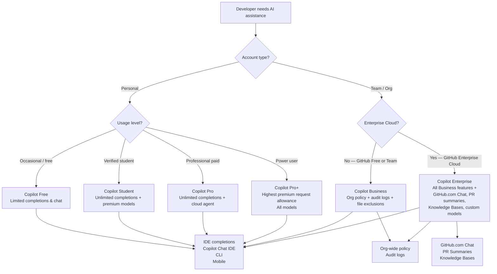

# GitHub Copilot Plans Overview

> Learning Objective: Distinguish between all GitHub Copilot plan tiers, identify which audiences each targets, and describe the full range of ways a developer can invoke Copilot assistance.

[Home](../../README.md) | [Domain Index](./README.md) | [Previous](./README.md) | [Next](./copilot-individual.md)

## Exam Relevance

- Domain weight: 31%
- Why it matters: Domain 2 is the highest-weighted section of the GH-300 exam at 31%. A solid grasp of the plan landscape is the prerequisite for every other feature question: you must know which tier unlocks which capability before answering scenario questions about specific features. Exam items frequently require you to select the right plan for a described scenario or identify which trigger mode a developer is using.

## Key Concepts

- **Six plan tiers:** GitHub Copilot is available as Free, Student, Pro, Pro+, Business, and Enterprise — each offering a progressively larger feature set and designed for a different buyer.
- **Individual plans** (Free, Student, Pro, Pro+) are self-managed on a personal GitHub account; no organisation admin involvement is needed.
- **Organisational plans** (Business and Enterprise) are managed by an organisation or enterprise owner who assigns seats to members.
- **Copilot in the IDE** is the editor extension installed in VS Code, JetBrains IDEs, Visual Studio, Neovim, Eclipse, Xcode, or Azure Data Studio. It delivers both ghost-text inline completions and the embedded Chat panel.
- **Copilot Chat in the IDE** is the conversational AI sidebar inside the editor — distinct from passive ghost-text completions — where developers ask questions in natural language and receive code, explanations, or command suggestions.
- **Trigger modes** are the distinct ways a developer can invoke Copilot: inline suggestions (ghost text), inline Chat, the Chat panel, GitHub.com Chat (Enterprise), the CLI extension, and via the GitHub mobile app.
- **Copilot for non-GitHub customers** — developers on platforms that are not GitHub.com can access AI completions through the VS Code GitHub Copilot extension authenticated with a GitHub account, but organisation-level governance requires GitHub.com.
- **Premium requests** are a metered resource (used for advanced models and agentic features); each plan tier provides a different monthly allowance.

## Visual Model

Notes:
- The left branch (Free → Pro+) covers individual developers; billing is on a personal account.
- The right branch (Business / Enterprise) requires an organisation owner to assign seats and configure policies.
- Enterprise is only purchasable alongside GitHub Enterprise Cloud (GHEC); Business can be purchased independently.
- Every paid plan includes IDE completions and the CLI extension; GitHub.com Chat is exclusive to Enterprise.

## Practical Examples and Scenarios

### Example 1: Selecting the right plan for an open-source maintainer

- Context: A verified maintainer of a popular open-source project wants unlimited code completions and access to Copilot cloud agent without paying a subscription fee.
- Action: They check their eligibility for Copilot Pro at no cost under the open-source maintainer benefit and activate it from their personal account settings.
- Outcome: They receive unlimited completions, the cloud agent, and a monthly premium-request allowance — the same entitlements as a paying Pro subscriber.

### Example 2: Choosing between Business and Enterprise for a SaaS company

- Context: A 200-person SaaS company uses GitHub Team plan (not Enterprise Cloud). They need organisation-wide Copilot policies and file exclusions but do not need PR summaries or Knowledge Bases.
- Action: The engineering lead purchases Copilot Business (standalone), which works with GitHub Free and Team organisations.
- Outcome: All developers receive IDE completions, the org admin gains policy control and audit logs, and the company avoids the higher cost of upgrading to GitHub Enterprise Cloud.

### Example 3: A developer invoking all trigger modes in one workflow

- Context: A developer is implementing a new REST endpoint in TypeScript.
- Action: (1) Ghost-text inline suggestion fills in the function body; (2) they press `Ctrl+I` to open inline Chat and type "add JSDoc"; (3) they switch to the Chat panel and ask "what are the security implications of this approach?"; (4) they open the terminal and run `gh copilot suggest "create a curl command to test this endpoint"`.
- Outcome: All four primary trigger modes were used: inline suggestion, inline Chat, Chat panel, and CLI — demonstrating the breadth of entry points available.

## Hands-on Practice Checklist

- [ ] Navigate to **github.com/settings/copilot** on your personal account and identify your current plan tier.
- [ ] In VS Code with the Copilot extension active, open a code file and observe the ghost-text suggestion appearing after you start typing a function.
- [ ] Press `Ctrl+I` (Windows/Linux) or `Cmd+I` (macOS) in VS Code to open inline Chat and type a short instruction such as "add error handling."
- [ ] Open the Copilot Chat sidebar panel and ask a multi-sentence question about how a piece of code works.
- [ ] Run `gh extension install github/gh-copilot` and confirm it is installed with `gh copilot --help`.
- [ ] If you manage an organisation, visit **Organisation Settings → Copilot → Policies** and identify at least three configurable policy toggles.

## Common Mistakes and Troubleshooting

- Mistake: Assuming Copilot Business and Copilot Enterprise both require GitHub Enterprise Cloud.
  Fix: Only Copilot Enterprise requires GHEC. Copilot Business can be purchased for organisations on GitHub Free or GitHub Team.

- Mistake: Treating inline Chat and the Chat panel as the same feature.
  Fix: Inline Chat (`Ctrl+I`/`Cmd+I`) appears as an overlay in the editor canvas; the Chat panel is the persistent sidebar. They are separate UI surfaces that can be used independently.

- Mistake: Believing Copilot Free provides unlimited usage.
  Fix: Copilot Free has a monthly cap on completions and chat interactions. Once the quota is exhausted, suggestions pause until the next cycle.

- Mistake: Thinking GitHub.com Chat is available on all plans.
  Fix: The Copilot Chat interface on the GitHub.com website requires the Copilot Enterprise plan.

- Mistake: Confusing "premium requests" with a separate product.
  Fix: Premium requests are a unit of metered consumption within your existing plan, used when you interact with non-default (premium) models or agentic features.

## Quick Recap

- Six plan tiers exist: Free, Student, Pro, Pro+, Business, Enterprise — moving from self-serve individual to enterprise-grade with governance tools.
- Individual plans are account-managed; Business and Enterprise are org/enterprise-managed with seat assignment.
- Copilot Enterprise is exclusively for GitHub Enterprise Cloud organisations and adds GitHub.com Chat, PR summaries, and Knowledge Bases on top of all Business features.
- Developers can trigger Copilot through: ghost-text inline suggestions, inline Chat (`Ctrl+I`), the Chat panel, GitHub.com Chat (Enterprise only), the CLI extension, and mobile.
- Copilot Free includes limited completions; Student, Pro, and Pro+ include unlimited completions with increasing premium-request allowances.

## Practice Questions

1. Which plan tier is designed specifically for organisations that use GitHub Team plan but do not have GitHub Enterprise Cloud?
   - Answer: Copilot Business (standalone).
   - Rationale: Copilot Business supports organisations on GitHub Free and GitHub Team. Copilot Enterprise requires GHEC.

2. A developer presses `Ctrl+I` while editing a function and types "refactor to use async/await." Which trigger mode are they using?
   - Answer: Inline Chat.
   - Rationale: `Ctrl+I` (or `Cmd+I` on macOS) opens the inline Chat overlay directly in the editor at the cursor position, distinct from the sidebar Chat panel or passive ghost-text completions.

3. Which of the following is exclusively available in the Copilot Enterprise plan and not in Copilot Business?
   - Answer: Copilot Chat on GitHub.com (and features that depend on it, such as PR summaries and Knowledge Bases).
   - Rationale: The GitHub.com-based Chat interface, pull request summary generation, and Knowledge Bases are Enterprise-only capabilities layered on top of the Business feature set.

4. A verified university student wants to use GitHub Copilot at no cost with unlimited completions. Which plan should they activate?
   - Answer: GitHub Copilot Student.
   - Rationale: The Student plan is available at no cost to verified students and includes unlimited completions, premium model access in Chat, and a monthly premium-request allowance.

## Originality Declaration

- This page was written as original instructional content.
- No protected source text was copied verbatim.

## Sources Consulted

- https://docs.github.com/en/copilot/get-started/plans
- https://docs.github.com/en/copilot/get-started/features
- https://docs.github.com/en/copilot/using-github-copilot/getting-code-suggestions-in-your-ide-with-github-copilot
- https://docs.github.com/en/copilot/github-copilot-in-the-cli/about-github-copilot-in-the-cli

## Potential Similarity Risk

- Risk level: Low
- Notes: Plan tier names (Free, Pro, Business, Enterprise) are product names required for accuracy. All conceptual explanations, examples, and diagrams are independently written.

## References

- Facts referenced; explanations are original.
- https://docs.github.com/en/copilot/get-started/plans
- https://docs.github.com/en/copilot/get-started/features

[Home](../../README.md) | [Domain Index](./README.md) | [Previous](./README.md) | [Next](./copilot-individual.md)
