# How GitHub Copilot Handles Data

> Learning Objective: Describe how GitHub Copilot collects, transmits, retains, and shares data differently depending on the plan tier, and explain the distinct data flows for code completion versus Copilot Chat.

[Home](../../README.md) | [Domain Index](./README.md) | [Previous](./data-pipeline-lifecycle.md) | [Next](./llm-limitations.md)

---

## Exam Relevance

- **Domain weight:** 15% (part of Domain 3 — How GitHub Copilot Works)
- Data handling is a privacy and compliance topic that frequently surfaces in exam scenarios where a team must decide whether Copilot is appropriate given the sensitivity of their codebase.
- Candidates are expected to identify the correct plan tier based on data retention requirements, and to know exactly which settings control opt-out behavior at the user and administrator levels.
- Understanding the two distinct data flows — code completion and Copilot Chat — is tested through scenario questions that ask what data leaves the IDE, how it is processed, and which plan features alter that behaviour.

---

## Key Concepts

- **Telemetry captures usage signals, not code content.** In the Copilot context, telemetry refers to anonymised usage events such as whether a developer accepted or dismissed a suggestion, how often a feature is triggered, and which editor extension version is in use. It does not, by itself, capture full source files.
- **Copilot Individual may retain prompts and suggestions by default.** Unless a user explicitly opts out, GitHub may use the code snippets sent as prompts and the suggestions returned to improve its AI models. This opt-out lives in the user's personal GitHub account settings under the "GitHub Copilot" section.
- **Copilot Business and Enterprise never retain prompts or suggestions for training.** Regardless of individual user settings, GitHub commits to not using any prompt or suggestion data from Business or Enterprise accounts to train or fine-tune its models. Telemetry is also off by default at the organisation level and can be further restricted by an administrator policy.
- **Code completion has a focused, single-turn data flow.** When a developer pauses while typing, the IDE extension collects the surrounding code context, assembles a prompt, and sends it to GitHub's proxy service. The proxy forwards the prompt to the underlying large language model, receives a completion response, and passes it back to the IDE where it appears as an inline ghost-text suggestion.
- **Copilot Chat has a richer, multi-turn data flow.** Each chat message includes the natural language question, the current conversation history, and any code context the developer has attached or that the extension has gathered from open files. For Enterprise users, semantically relevant chunks retrieved from an indexed Knowledge Base are also injected into the prompt before it reaches the model.
- **Copilot Chat is designed to process multiple input types.** These include natural language questions about code behaviour, requests to explain, refactor, or translate code, prompts to generate new code from a description, questions about error messages, and — in Enterprise — queries directed at internal documentation or repository content surfaced through Knowledge Bases.
- **Opt-out scope differs by plan tier.** Individual users can toggle data use for product improvement in their account settings. At Business and Enterprise tier, administrators can enforce organisation-wide policies that prevent telemetry collection and restrict the data Copilot may access, regardless of individual preferences.

---

## Visual Model

```mermaid
flowchart TD
    subgraph FlowA ["🔵 Flow A — Code Completion"]
        A1["Developer types in IDE\n(keystrokes pause)"]
        A2["Extension gathers\ncode context window"]
        A3["Prompt sent to\nGitHub Proxy"]
        A4["Proxy forwards to\nLLM"]
        A5["LLM returns\ncompletion"]
        A6["Proxy relays\nresponse"]
        A7["Suggestion displayed\nas inline ghost text"]
        A8(["Telemetry: accept /\nreject event logged\n(Individual default ON;\nBusiness/Enterprise OFF)"])

        A1 --> A2 --> A3 --> A4 --> A5 --> A6 --> A7
        A7 -.->|"user action"| A8
    end

    subgraph FlowB ["🟢 Flow B — Copilot Chat"]
        B1["Developer types\nchat message"]
        B2["Extension assembles:\nmessage + code context\n+ conversation history"]
        B3["Enterprise only:\nKnowledge Base chunks\ninjected into prompt"]
        B4["Full prompt sent to\nGitHub Proxy"]
        B5["Proxy filters\ninbound content"]
        B6["LLM generates\nresponse"]
        B7["Proxy filters\noutbound response"]
        B8["Response displayed\nin Chat panel"]

        B1 --> B2
        B2 --> B3
        B3 -->|"Enterprise"| B4
        B2 -->|"Individual / Business"| B4
        B4 --> B5 --> B6 --> B7 --> B8
    end
```

**Diagram notes:**

- Both flows pass through GitHub's proxy service, which acts as an intermediary between the IDE and the LLM — the developer's machine never communicates directly with the model endpoint.
- The telemetry event in Flow A (acceptance or rejection of a suggestion) is the primary signal used for product improvement under the Individual plan; opting out in account settings suppresses this data collection.
- The Knowledge Base injection step in Flow B is exclusive to Copilot Enterprise; it retrieves semantically relevant document chunks from an admin-indexed repository or documentation source and appends them to the prompt, enabling answers grounded in internal codebase knowledge.

---

## Key Terms

- **Telemetry**: Anonymised usage-event data collected by GitHub to understand how Copilot features are used — for example, suggestion acceptance rates, feature invocation counts, and extension version metrics. Does not refer to bulk source-code capture.
- **Prompt retention**: The practice of storing the code context snippets sent to the LLM after a Copilot session ends. Enabled by default on the Individual plan (opt-out available); permanently disabled for Business and Enterprise accounts.
- **Suggestion retention**: The practice of storing the completions or chat responses returned by the LLM. Follows the same policy as prompt retention — off by default for Business/Enterprise; opt-out available for Individual.
- **Opt-out**: A user or administrator action that prevents GitHub from collecting and using prompt or telemetry data for model improvement. On the Individual plan, this is a per-user account toggle; on Business/Enterprise, administrators enforce it via organisation policy.
- **Data flow**: The end-to-end path that data travels from the developer's IDE through GitHub's proxy to the LLM and back. Two distinct flows exist: code completion (single-turn, context snippet) and Copilot Chat (multi-turn, conversation + code + optional Knowledge Base chunks).
- **Input processing**: The set of input types that Copilot Chat is designed to interpret and act on — natural language questions, code blocks, error messages, refactoring requests, and (for Enterprise) queries about internal documentation.
- **Knowledge Base**: An Enterprise-only feature that allows administrators to index one or more internal repositories or documentation sources. During a Chat session, relevant chunks are retrieved via semantic search and appended to the prompt, grounding the model's response in organisation-specific content.
- **Code referencing**: A feature that can surface whether a Copilot suggestion closely matches publicly available code. When enabled, GitHub may flag suggestions with a reference to a matching public repository, helping developers assess licence implications.

---

## Cheat Sheet

| Dimension | Individual | Business | Enterprise |
|---|---|---|---|
| **Prompt retention** | On by default; user can opt out | Never retained | Never retained |
| **Suggestion retention** | On by default; user can opt out | Never retained | Never retained |
| **Telemetry default** | On (usage events collected) | Off by default | Off by default |
| **User opt-out** | Yes — account settings → GitHub Copilot → toggle off "Allow GitHub to use my code snippets" | N/A (never retained) | N/A (never retained) |
| **Org/admin opt-out** | Not applicable | Admin can enforce policy; telemetry off by default | Admin can enforce stricter policy; telemetry off by default |
| **Chat context sources** | Natural language + attached code + open file context | Natural language + attached code + open file context | All of the above + indexed Knowledge Base chunks |
| **Knowledge Base access** | ✗ Not available | ✗ Not available | ✓ Admin-indexed repos/docs injected into Chat prompts |

---

## Quick Recap

- GitHub Copilot's data handling behaviour differs meaningfully by plan tier: Individual users must actively opt out of prompt and suggestion retention, while Business and Enterprise accounts receive zero-retention guarantees by design.
- Telemetry — usage event signals such as accept/reject actions — is collected by default on Individual and turned off by default on Business and Enterprise.
- Code completion travels as a single context snapshot through GitHub's proxy to the LLM and back; no persistent storage of that snippet occurs on Business or Enterprise accounts.
- Copilot Chat builds a richer prompt that includes conversation history, attached code, and (on Enterprise) Knowledge Base chunks retrieved by semantic search — making it a more context-aware flow than code completion.
- Administrators on Business and Enterprise plans hold the policy levers: they can restrict data use, disable telemetry, and control which features are available to their organisation's developers.

---

## Practice Questions

**1.** A startup uses Copilot Business and is worried that the proprietary algorithms described in their prompts are being fed into GitHub's training pipeline. Is their concern valid?

- **Answer:** No, the concern is not valid for Copilot Business.
- **Rationale:** GitHub's terms for Copilot Business explicitly state that prompts and suggestions are never retained or used for model training. The startup's proprietary prompt content leaves their IDE only to generate a response and is not stored beyond that session by GitHub.

---

**2.** An individual developer wants to ensure that GitHub cannot use their accepted code suggestions to improve Copilot's models. What single action must they take?

- **Answer:** Navigate to their personal GitHub account settings, open the "GitHub Copilot" section, and disable the option labelled "Allow GitHub to use my code snippets for product improvements."
- **Rationale:** On the Individual plan, prompt and suggestion retention is on by default for model improvement. The opt-out is a per-user account setting; disabling the IDE extension or switching IDEs does not achieve the same result.

---

**3.** What additional context source can Enterprise users include in a Copilot Chat prompt that is unavailable to Business users?

- **Answer:** Chunks retrieved from an admin-indexed Knowledge Base.
- **Rationale:** Copilot Enterprise allows administrators to index internal repositories and documentation. During a Chat session, relevant passages from those sources are injected into the prompt, enabling the model to answer questions grounded in organisation-specific content. This feature does not exist on the Business plan.

---

**4.** A developer sends a chat message asking Copilot to explain a stack trace they have pasted into the chat window. Which data flow applies, and what components make up the prompt that reaches the LLM?

- **Answer:** The Copilot Chat data flow applies. The prompt sent to the LLM will include the developer's natural language question, the pasted stack trace (attached code/text context), and the prior conversation history from that chat session.
- **Rationale:** Any interaction through the Chat panel — regardless of whether it involves natural language, code, or error output — follows the Chat data flow, not the code completion flow. The proxy assembles all in-session context before forwarding to the model.

---

**5.** An enterprise security team reviews Copilot's data flow and notices that suggestions sometimes contain patterns similar to public open-source code. Which Copilot feature is designed to surface this situation, and what does it provide?

- **Answer:** The code referencing feature (also called "duplication detection" in some contexts).
- **Rationale:** When code referencing is enabled, GitHub checks whether a suggestion closely matches publicly available code in its index. If a match is found, the suggestion may be flagged with a reference to the source repository, allowing the developer to review potential licence implications before accepting the suggestion.

---

## Originality Declaration

- All explanations, tables, diagrams, and practice questions are original instructional content.
- No source text was copied verbatim; sources were used for factual grounding only.

---

## Sources Consulted

- https://docs.github.com/en/copilot/overview-of-github-copilot/about-github-copilot-individual
- https://docs.github.com/en/copilot/privacy-and-security-for-github-copilot
- https://docs.github.com/en/copilot/github-copilot-enterprise/overview/about-github-copilot-enterprise

---

## Potential Similarity Risk

- **Risk level:** Low
- **Notes:** Data handling facts are drawn from official GitHub documentation. The framing, tables, flowcharts, and practice questions are fully original. Standard technical vocabulary (telemetry, prompt retention, opt-out, data flow) is unavoidable in any accurate treatment of this topic and does not constitute similarity risk on its own.

---

## References

- Facts referenced; all explanations and examples are original.
- GitHub Copilot Individual — Privacy and data use: https://docs.github.com/en/copilot/overview-of-github-copilot/about-github-copilot-individual
- GitHub Copilot privacy and security overview: https://docs.github.com/en/copilot/privacy-and-security-for-github-copilot
- GitHub Copilot Enterprise overview: https://docs.github.com/en/copilot/github-copilot-enterprise/overview/about-github-copilot-enterprise

---

[Home](../../README.md) | [Domain Index](./README.md) | [Previous](./data-pipeline-lifecycle.md) | [Next](./llm-limitations.md)
