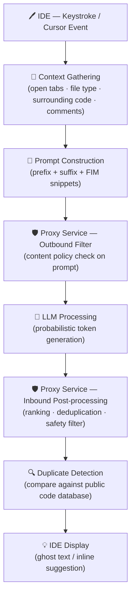

# Data Pipeline Lifecycle

[Home](../../README.md) | [Domain Index](./README.md) | [Previous](./README.md) | [Next](./data-handling.md)

> **Learning Objective:** Trace the complete journey of a GitHub Copilot suggestion from keystroke to displayed result, identifying each stage and the role it plays.

---

## Exam Relevance

- **Domain weight:** 15% (part of Domain 3 — How GitHub Copilot Works)
- This subtopic is the conceptual backbone of Domain 3. Every other Copilot behaviour — quality of suggestions, latency, filtering, and privacy — can be traced back to a specific stage in this pipeline.
- Exam questions frequently present a symptom (e.g. "a suggestion was never shown", "two identical requests produced different output") and ask candidates to identify the responsible stage.
- Understanding the end-to-end flow also clarifies why suggestions occasionally lack context, feel slow, or are blocked before reaching the developer's screen.

---

## Key Concepts

- **Context is assembled from multiple sources.** When a developer types or pauses, the Copilot extension harvests context from the cursor position, the code immediately before and after it, the active file's language and type, inline comments, and content from other currently open editor tabs. The richer the context, the more targeted the eventual suggestion.

- **Prompts are constructed using a fill-in-the-middle (FIM) strategy.** Rather than only passing the lines above the cursor, Copilot builds a structured input that contains a *prefix* (code before the cursor), a *suffix* (code after the cursor), and optionally *snippets* extracted from related open files. This three-part arrangement lets the model understand both what has already been written and where the code is heading.

- **The proxy service is the trust boundary between the IDE and the model.** Every request travels through GitHub's proxy layer before it reaches the large language model (LLM). The proxy applies outbound content filters to the assembled prompt, stripping or rejecting inputs that could be harmful, and it applies inbound filters to the model's raw output before anything is forwarded back to the IDE. It acts as both a security gateway and a quality checkpoint.

- **Content filters operate in both directions.** On the way out, filters check whether the prompt itself contains disallowed material. On the way back, filters inspect the generated suggestion for unsafe patterns, leaked credentials, or policy-violating content. A suggestion can be blocked at either pass without the developer seeing any indication of a raw model response.

- **The LLM generates suggestions probabilistically, one token at a time.** At each step the model assigns a probability to every token in its vocabulary and samples from that distribution. Because the process involves sampling, the same prompt can yield different completions on separate calls — this is an intentional design feature, not a bug.

- **Post-processing refines the raw model output before display.** After the LLM returns one or more candidate completions, the proxy layer ranks them, removes near-duplicate alternatives, trims trailing unsafe patterns, and selects the best candidate to forward to the IDE. The IDE then renders it as translucent *ghost text* inline with the editor.

- **Duplicate detection guards against surfacing verbatim public code.** Before a suggestion is displayed, Copilot compares it against a database of publicly available repository code. If the suggestion closely mirrors existing open-source code, it may be flagged or suppressed depending on the user's or organization's *public code matching* setting. When the feature is enabled and a match is found, the suggestion is blocked to respect licensing considerations.

---

## Visual Model

**Diagram notes:**

1. **Two proxy passes** — the proxy appears twice because it performs distinct jobs: an *outbound* check on the prompt before it reaches the model, and an *inbound* check on the model's output before it reaches the IDE. Think of it as a two-way customs inspection.
2. **FIM layout** — the prompt passed to the LLM is not just the lines above the cursor. It deliberately includes code below the cursor (the suffix) so the model can produce a completion that fits naturally into the existing structure.
3. **Probabilistic generation** — because the LLM samples from probability distributions, repeat invocations with identical context can produce different suggestions. Latency also varies based on model load and token count.
4. **Duplicate detection is a late-stage gate** — it runs on the already-filtered output, not on the raw prompt. A suggestion that passes all content filters can still be suppressed here if it too closely mirrors public repository code.

---

## Key Terms

- **Context**: All information the IDE extension gathers about the current editing session — cursor position, surrounding code, open file names and their contents, language identifier, and comments — that is used to build the prompt.
- **Prompt**: The structured input sent to the LLM, composed of a prefix (code before the cursor), a suffix (code after the cursor), and relevant code snippets drawn from other open files.
- **Proxy service**: GitHub's server-side intermediary that sits between the IDE extension and the LLM; it enforces content policies in both directions and handles routing, authentication, and telemetry.
- **Content filter**: A rule-based or model-based check applied by the proxy to detect and block disallowed material — applied once to the outgoing prompt and once to the incoming suggestion.
- **Token**: The fundamental unit the LLM works with; roughly a word fragment or punctuation mark. The model generates tokens sequentially, each chosen based on a probability distribution conditioned on all prior tokens.
- **Post-processing**: Steps applied to raw LLM output after generation — including ranking multiple candidates, removing near-duplicates, and stripping unsafe content — before the best result is sent to the IDE.
- **Duplicate detection**: A comparison mechanism that checks a generated suggestion against a corpus of public repository code; if a near-verbatim match is found, the suggestion can be flagged or suppressed based on the configured public code matching policy.
- **Ghost text**: The visual representation of a Copilot suggestion in the IDE — displayed as translucent, greyed-out inline text that a developer can accept (Tab), partially accept, or dismiss.

---

## Cheat Sheet

| Stage | Key Fact |
|---|---|
| **IDE — Context Gathering** | Harvests cursor position, surrounding code, file language, comments, and content from open tabs |
| **Prompt Construction** | Assembles prefix + suffix + FIM snippets; three-part structure enables "fill in the middle" completions |
| **Proxy — Outbound Filter** | Inspects the assembled prompt for policy violations before forwarding to the LLM |
| **LLM Processing** | Generates tokens one at a time using probability sampling; same prompt can yield different outputs |
| **Proxy — Inbound Post-processing** | Ranks candidates, removes duplicates, strips unsafe patterns from raw model output |
| **Duplicate Detection** | Compares suggestion against public code database; suppresses matches based on public code matching setting |
| **IDE Display** | Renders accepted suggestion as ghost text; accepted/rejected telemetry may be sent back to GitHub |

---

## Quick Recap

- A Copilot suggestion travels through **seven distinct stages**: context gathering → prompt construction → outbound proxy filter → LLM generation → inbound proxy post-processing → duplicate detection → IDE display.
- The **proxy service is the single most important security control** in the pipeline; it enforces policy on both the input (prompt) and the output (suggestion).
- The **FIM prompt format** (prefix + suffix + snippets) is what allows Copilot to generate code that fits the surrounding structure, not just continue from the last line.
- **Probabilistic token generation** means that two identical coding contexts can produce different suggestions — variation is by design and enables creative completions.
- **Duplicate detection** is a late-stage gate that protects against surfacing verbatim licensed code; its behaviour is governed by the user's or organisation's public code matching policy.

---

## Practice Questions

1. **A developer reports that Copilot occasionally shows no suggestion at all, even though their code compiles fine. A colleague says it must be a network issue. Which pipeline stage is the most likely cause, and why?**
   - **Answer:** The proxy service (either the outbound or inbound content filter).
   - **Rationale:** When the proxy's content filter determines that either the prompt or the generated suggestion violates policy, the suggestion is suppressed silently. A network error would typically surface as an error message, not a silent absence of suggestions. The filter stage is the correct culprit for invisible blocking.

2. **A team lead asks why Copilot seems to "know" about a helper function defined in a different file that is currently open in a split view. Which pipeline concept explains this behaviour?**
   - **Answer:** Context gathering and FIM snippet inclusion during prompt construction.
   - **Rationale:** Copilot's context gathering phase scans content from other open editor tabs, not just the active file. Relevant snippets from those tabs are embedded into the prompt alongside the prefix and suffix, giving the LLM awareness of symbols and patterns defined elsewhere in the session.

3. **A developer runs the exact same incomplete function body twice in quick succession, with no edits in between. The two suggestions are noticeably different. Is this a bug? Which pipeline stage explains it?**
   - **Answer:** No — this is expected behaviour caused by probabilistic token generation in the LLM processing stage.
   - **Rationale:** The LLM does not deterministically map inputs to outputs. At each token position it samples from a probability distribution, so even identical prompts can produce different completions. Temperature and sampling settings govern how much variation occurs, but some degree of non-determinism is inherent to transformer-based language models.

4. **An organisation has enabled the public code matching policy in their Copilot settings. A developer then receives fewer suggestions than a colleague on a personal plan with the policy disabled. Which pipeline stage accounts for this difference, and what does it do?**
   - **Answer:** The duplicate detection stage.
   - **Rationale:** Duplicate detection compares each generated suggestion against a database of publicly available code. When the public code matching policy is enabled, suggestions that closely mirror existing open-source code are suppressed before reaching the IDE. With the policy disabled, those same suggestions would be displayed without the additional check.

5. **Exam scenario — a Copilot suggestion for a SQL query contains exactly the correct table names and column names even though the schema is only defined in a migration file open in another editor tab. At which stage does Copilot acquire that schema knowledge, and how is it incorporated into the model input?**
   - **Answer:** Context gathering stage — the schema information is picked up from the open migration file and included as a snippet during prompt construction.
   - **Rationale:** During context gathering, the IDE extension reads content from all relevant open tabs. The migration file's table and column definitions are extracted as a snippet and embedded into the FIM-formatted prompt alongside the prefix and suffix. The LLM therefore "sees" the schema as part of its input and can produce a query that references the correct identifiers.

---

## Originality Declaration

- All explanations, diagrams, and practice questions are original instructional content.
- No source text was copied verbatim; sources were used for factual grounding only.

---

## Sources Consulted

- https://docs.github.com/en/copilot/overview-of-github-copilot/about-github-copilot-individual
- https://resources.github.com/learn/pathways/copilot/essentials/how-github-copilot-works/
- https://learn.microsoft.com/en-us/training/modules/introduction-to-github-copilot/

---

## Potential Similarity Risk

- **Risk level:** Low
- **Notes:** Pipeline stage names and technical vocabulary (proxy, LLM, token, FIM) are standard industry terms that appear across GitHub's own documentation, academic literature, and engineering blogs. All descriptions on this page are original restatements of publicly documented behaviour. The Mermaid diagram structure and practice question scenarios are uniquely constructed for this study guide.

---

## References

- Facts referenced; explanations are original.
- GitHub Docs — About GitHub Copilot Individual: https://docs.github.com/en/copilot/overview-of-github-copilot/about-github-copilot-individual
- GitHub Learning Pathways — How GitHub Copilot Works: https://resources.github.com/learn/pathways/copilot/essentials/how-github-copilot-works/
- Microsoft Learn — Introduction to GitHub Copilot: https://learn.microsoft.com/en-us/training/modules/introduction-to-github-copilot/

---

[Home](../../README.md) | [Domain Index](./README.md) | [Previous](./README.md) | [Next](./data-handling.md)
