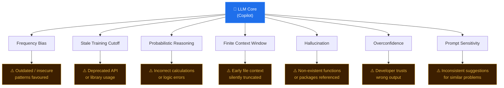
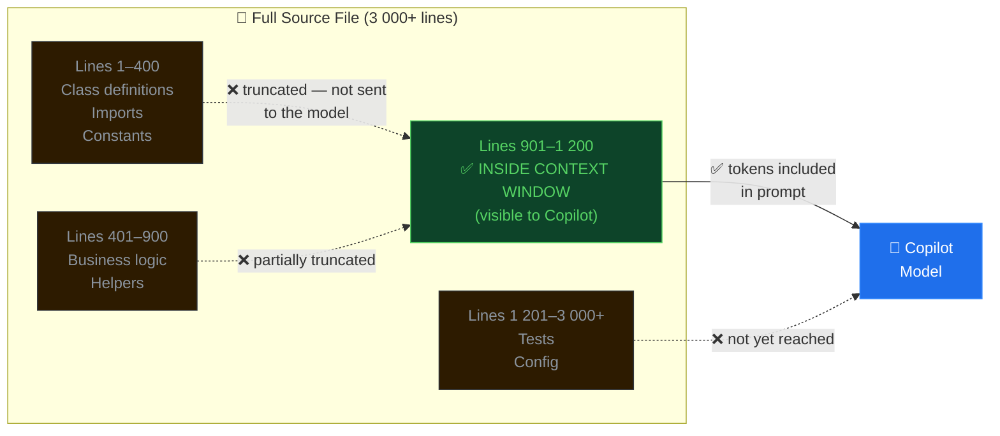

# LLM and Copilot Limitations

> Learning Objective: Identify the core limitations of large language models as they apply to GitHub Copilot, and explain why these constraints require developers to critically evaluate all AI-generated suggestions.

[Home](../../README.md) | [Domain Index](./README.md) | [Previous](./data-handling.md) | [Next](../domain-4-prompt-engineering/README.md)

---

## Exam Relevance

- **Domain weight:** 15% (part of Domain 3 — How GitHub Copilot Works)
- Exam questions in this area test whether candidates understand that Copilot is a **probabilistic tool**, not an oracle. Scenarios often describe a developer trusting Copilot output blindly — or expecting exact mathematical answers — and ask candidates to identify the underlying limitation.
- Questions may present a short narrative (e.g., "Copilot suggested a method that doesn't exist") and ask which LLM characteristic caused the behaviour.
- Understanding these limits also motivates best practices covered in Domain 4 (prompt engineering) and Domain 5 (responsible use), so this page is a conceptual foundation for the whole exam.

---

## Key Concepts

- **Training data bias toward frequent patterns:** A language model learns by compressing statistical regularities across billions of code samples. Patterns that appear most often — even if they are suboptimal or insecure — receive more weight in the model's probability distribution. This means Copilot may confidently suggest a common-but-flawed idiom simply because the training corpus was saturated with it.

- **Code suggestion age and relevance:** Every model is trained on a snapshot of data up to a fixed cutoff date. Libraries deprecate functions, security advisories retire patterns, and language standards evolve — but the model has no mechanism to discover these changes unless the developer provides that context in the prompt. Suggestions for recently updated APIs should always be cross-checked against current documentation.

- **Probabilistic reasoning, not deterministic calculation:** Copilot does not execute code or run arithmetic. It predicts the most statistically probable sequence of tokens to follow a given prompt. For logic that requires exact computation — checksums, bit-shifting, complex conditionals — the model may produce output that looks syntactically correct but is mathematically wrong. Any numerically sensitive output must be verified independently.

- **Context window limits:** The model can only attend to a fixed number of tokens at one time. For inline code completion this window spans a few thousand tokens of surrounding code; for Copilot Chat it includes the conversation history up to the same limit. In large files or long conversations, content outside the window is simply invisible to the model — it cannot "scroll back" to retrieve earlier context.

- **Hallucinations:** Because the model's goal is producing plausible-looking output rather than factually correct output, it can generate references to functions, packages, or APIs that sound reasonable but do not exist. The code will compile (sometimes) and look professional, yet fail at runtime because the referenced symbol never existed.

- **Overconfidence in output tone:** The model produces every suggestion with the same neutral, authoritative tone — regardless of whether the suggestion is correct, partially correct, or entirely fabricated. There is no built-in uncertainty signal, no "I'm not sure about this." Developers who interpret confident presentation as a proxy for correctness will be misled.

- **Sensitivity to prompt phrasing:** The probability distribution the model uses to generate the next token is highly sensitive to the exact wording of the prompt. A slight rephrasing — changing "write a function that sorts" to "implement a sort function" — can push the model down a different generation path and produce a meaningfully different result. This variability is important for prompt engineering (Domain 4) and explains why iteration matters.

---

## Visual Model

### Diagram 1 — Limitations and Developer Risks

**Notes:**

- Every limitation flows from the same root: the model is a pattern-completion engine, not a reasoning or execution engine.
- The risks on the right are not theoretical — each maps to a real failure mode that developers encounter daily.
- Frequency Bias and Stale Training Cutoff are both rooted in the training data; they differ only in *which* dimension of that data causes the problem (prevalence vs. recency).
- The developer's primary defence against all seven risks is the same: **review every suggestion before accepting it**.

---

### Diagram 2 — The Context Window as a Sliding Viewport

**Notes:**

- Only the content within the active context window reaches the model — everything outside it might as well not exist.
- As the developer scrolls down and edits in the middle of a large file, the top of the file (class declarations, type definitions) may fall outside the window.
- This explains why Copilot sometimes "forgets" an interface or base class defined far above the current cursor position.
- Keeping related context close together — or explicitly referencing it in a Chat prompt — is the correct mitigation.

---

## Key Terms

- **Hallucination**: Output that is syntactically well-formed and appears plausible, but refers to functions, APIs, or packages that do not actually exist; caused by the model prioritising fluency over factual accuracy.
- **Context window**: The fixed-size token budget available to the model for a single inference call; content beyond this limit is not seen by the model and cannot influence the suggestion.
- **Probabilistic model**: A system that assigns probability scores to candidate next tokens and samples from that distribution, rather than computing a logically guaranteed correct answer.
- **Training data cutoff**: The date beyond which no new information was included in the model's training corpus; changes to libraries, APIs, or best practices after this date are unknown to the model unless injected via prompt.
- **Token**: The atomic unit a language model processes — roughly 3–4 characters or 0.75 words on average; both the prompt and the generated output are measured and limited in tokens.
- **Overconfidence**: The property of LLM output whereby suggestions are expressed with the same neutral, authoritative tone regardless of their accuracy, giving no signal to the developer that the output may be wrong.
- **Frequency bias**: The tendency of the model to prefer patterns that appeared most often in training data, even when less common alternatives would be more appropriate or secure.
- **Deterministic calculation**: Exact arithmetic or logical computation that produces a single, reproducible correct result — a task LLMs are architecturally unsuited for because they predict probable tokens, not computed values.

---

## Cheat Sheet

| Limitation | Root Cause | Developer Risk | Mitigation |
|---|---|---|---|
| **Frequency bias** | Over-represented patterns in training data skew the model's probability weights | Suboptimal, insecure, or outdated idioms appear in suggestions | Treat suggestions as a first draft; apply code review and linting |
| **Stale training data** | Fixed cutoff date; post-cutoff changes are invisible | Deprecated API calls, removed functions, outdated syntax | Cross-check suggestions against current official documentation |
| **Probabilistic reasoning** | Tokens are predicted by probability, not computed by logic | Arithmetic, checksums, and complex conditions may be silently wrong | Always independently verify numeric and logic-critical output |
| **Context window limit** | Finite token budget; content outside the window is not processed | Early file context (imports, types, base classes) silently ignored | Break large files into smaller modules; pin key context in Chat prompts |
| **Hallucination** | Model optimises for fluent-sounding output over factual accuracy | References to non-existent functions crash at runtime | Run and test all generated code; verify every external symbol |
| **Overconfidence** | No built-in uncertainty signal in token generation | Developer mistakes confident tone for correctness | Adopt a "junior developer" mental model — always review, never blindly accept |

---

## Quick Recap

- Copilot is a **token-prediction engine**, not a code executor or calculator; every suggestion is a statistically probable completion, not a logically guaranteed answer.
- **Frequency bias** means common-but-wrong patterns can be confidently reproduced; popularity in training data does not equal correctness.
- The **training data cutoff** makes the model blind to anything released or changed after that date — library updates, security patches, and new APIs are all invisible without explicit prompting.
- The **context window** is a hard boundary; in files larger than a few thousand tokens, Copilot cannot "see" context outside the current window, leading to suggestions that contradict or ignore earlier definitions.
- **Hallucinated** symbols look real but do not exist; the only defence is running and testing the code, not just reading it.
- Because the model never signals uncertainty, the developer must supply the scepticism — treat every Copilot suggestion the way you would review code from a confident but fallible colleague.

---

## Practice Questions

**1. A developer asks Copilot to compute a precise checksum value for a block of binary data. The suggestion looks correct syntactically but produces the wrong result at runtime. Which LLM limitation best explains this?**

- **Answer:** Probabilistic reasoning (not deterministic calculation).
- **Rationale:** Copilot predicts the most probable sequence of tokens, it does not execute the algorithm or perform binary arithmetic. For exact computations — checksums, hashes, bit operations — the output must always be tested against known inputs and expected outputs.

---

**2. Copilot suggests using `library.fetchSync()`, a function that was deprecated and removed six months ago. The code does not compile. What limitation caused this?**

- **Answer:** Stale training data / training data cutoff.
- **Rationale:** The model's training corpus has a fixed end date. If `library.fetchSync()` was removed after that date, the model has no knowledge of the removal and continues treating the function as valid. Developers should verify AI-generated API calls against the current version of the library's documentation.

---

**3. A team notices that Copilot consistently generates a `for` loop with a manual index variable even when a more readable `forEach` or list-comprehension equivalent would be more appropriate. What explains this behaviour?**

- **Answer:** Frequency bias.
- **Rationale:** If indexed `for` loops appeared far more often than their alternatives in the training data, the model will weight that pattern heavily in its probability distribution. This does not mean the alternative is wrong — just less probable in the model's learned distribution. Developers can guide Copilot toward alternatives with an explicit prompt or by demonstrating the preferred pattern in a nearby comment.

---

**4. A developer is editing a 3 000-line file. Copilot generates a method that contradicts the interface contract defined at the top of the file in lines 10–40. When asked about the interface in Copilot Chat, it claims to have no information about it. What limitation is at play?**

- **Answer:** Context window limit.
- **Rationale:** The model can only attend to a finite number of tokens in a single inference call. When editing near line 3 000, the content from lines 10–40 is likely outside the active window and has been silently excluded from the prompt. The model is not ignoring the interface — it genuinely cannot see it. Moving key definitions closer to the active cursor, or pasting the relevant section into a Chat prompt, resolves this.

---

**5. Copilot generates a method call `cache.invalidateByKeyspace("users")`. It compiles but throws a `NoSuchMethodError` at runtime because the method does not exist in the caching library in use. What is this phenomenon called, and what is its root cause?**

- **Answer:** Hallucination.
- **Rationale:** The model generated a syntactically valid, contextually plausible method name that does not correspond to any real symbol. Because the model optimises for fluent, coherent-looking output rather than verified accuracy, it can produce references that sound like they belong to a library without any real grounding. The mitigation is to test all generated code and verify every external symbol against actual library documentation or IDE auto-complete.

---

## Originality Declaration

- All explanations, diagrams, tables, and practice questions are original instructional content.
- No source text was copied verbatim; sources were used for factual grounding only.

---

## Sources Consulted

- <https://learn.microsoft.com/en-us/training/modules/introduction-to-github-copilot/>
- <https://resources.github.com/learn/pathways/copilot/essentials/how-github-copilot-works/>
- <https://docs.github.com/en/copilot/overview-of-github-copilot/about-github-copilot-individual>

---

## Potential Similarity Risk

- **Risk level:** Low
- **Notes:** Terms such as "hallucination", "context window", "training cutoff", and "probabilistic model" are standard vocabulary in the LLM and AI-safety fields and appear across many public sources. Their use here is definitional and unavoidable. All scenario-based practice questions, table rows, diagram structures, and explanatory notes were composed independently. No sentences from the consulted sources were reproduced.

---

## References

- Facts referenced; all explanations and scenarios are original.
- GitHub Copilot overview — <https://docs.github.com/en/copilot/overview-of-github-copilot/about-github-copilot-individual>
- Introduction to GitHub Copilot (Microsoft Learn) — <https://learn.microsoft.com/en-us/training/modules/introduction-to-github-copilot/>
- How GitHub Copilot Works (GitHub Resources) — <https://resources.github.com/learn/pathways/copilot/essentials/how-github-copilot-works/>

---

[Home](../../README.md) | [Domain Index](./README.md) | [Previous](./data-handling.md) | [Next](../domain-4-prompt-engineering/README.md)
